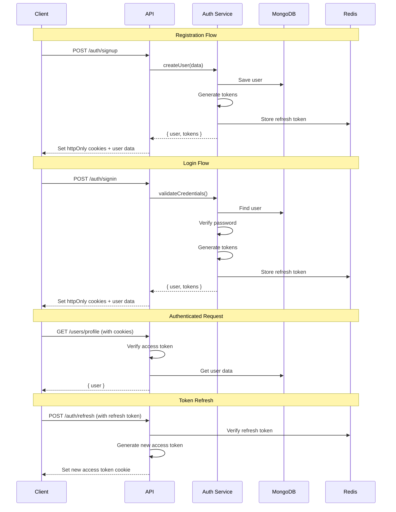

# API Documentation

> **Last Updated:** 2025-12-22  
> **API Version:** v1  
> **Base URL:** `/api/v1`

This document provides comprehensive documentation for all REST API endpoints in the **erion-raven** backend application.

## 📋 Table of Contents

- [Overview](#overview)
- [Base URL](#base-url)
- [Authentication](#authentication)
- [Response Format](#response-format)
- [Status Codes](#status-codes)
- [Middleware](#middleware)
- [Rate Limiting](#rate-limiting)
- [API Endpoints](#api-endpoints)
  - [Authentication APIs](#authentication-apis)
  - [User APIs](#user-apis)
  - [Conversation APIs](#conversation-apis)
  - [Friend APIs](#friend-apis)
  - [Message APIs](#message-apis)
  - [WebSocket Management APIs](#websocket-management-apis)
- [WebSocket Events](#websocket-events)
- [Usage Examples](#usage-examples)

---

## 🎯 Overview

The API follows RESTful principles and uses JSON for request and response bodies. All endpoints require HTTPS in production and support CORS for cross-origin requests.

### Key Features

- ✅ **JWT Authentication** - Secure token-based auth
- ✅ **Rate Limiting** - Redis-based request throttling
- ✅ **Input Validation** - Zod schema validation
- ✅ **Error Handling** - Consistent error responses
- ✅ **Soft Deletes** - Data preservation with deletedAt

---

## 🌐 Base URL

All API endpoints are prefixed with `/api/v1`.

**Development:**
```
http://localhost:8080/api/v1
```

**Production:**
```
https://your-domain.com/api/v1
```

---

## 🔐 Authentication

### Authentication Flow



### Token Types

| Token | Storage | Expiry | Purpose |
|-------|---------|--------|---------|
| **Access Token** | httpOnly cookie | 15 minutes | API authentication |
| **Refresh Token** | httpOnly cookie | 7 days | Token renewal |

### Protected Endpoints

Most endpoints require authentication. Include the access token in cookies:

```bash
curl -X GET http://localhost:8080/api/v1/users/profile \
  -H "Cookie: accessToken=your-jwt-token"
```

---

## 📊 Response Format

### Success Response

```json
{
  "success": true,
  "data": {
    // Response data
  }
}
```

### Error Response

```json
{
  "success": false,
  "message": "Error message",
  "code": 400
}
```

Or:

```json
{
  "code": 400,
  "message": "Error message",
  "details": "Detailed error description"
}
```

---

## 🔢 Status Codes

| Code | Status | Meaning | When to Use |
|------|--------|---------|-------------|
| **200** | OK | Success | Successful GET, PUT, DELETE requests |
| **201** | Created | Resource created | Successful POST requests |
| **400** | Bad Request | Invalid input | Validation errors, missing fields |
| **401** | Unauthorized | Not authenticated | Missing or invalid token |
| **403** | Forbidden | No permission | User lacks required permissions |
| **404** | Not Found | Resource not found | Requested resource doesn't exist |
| **409** | Conflict | Resource conflict | Duplicate email, username, etc. |
| **429** | Too Many Requests | Rate limit exceeded | Too many requests in time window |
| **500** | Internal Server Error | Server error | Unexpected server errors |

---

## 🛡️ Middleware

| Name | Description |
|------|-------------|
| `authRateLimit` | Rate limiting for authentication endpoints |
| `generalRateLimit` | Rate limiting for general authenticated endpoints |
| `authenticateToken` | Validates JWT access token from cookies |
| `validateDto` | Validates request body against a DTO schema |
| `socketAuth` | Authenticates WebSocket connections |

---

## ⏱️ Rate Limiting

Rate limiting is implemented using Redis to prevent abuse and ensure fair usage.

### Rate Limit Tiers

| Tier | Endpoints | Window | Max Requests | Applies To |
|------|-----------|--------|--------------|------------|
| **Auth** | `/auth/*` | 15 minutes | 5 requests | Registration, login, refresh |
| **General** | All authenticated endpoints | 15 minutes | 100 requests | User, conversation, message, friend APIs |
| **WebSocket** | Socket.IO connections | Per user | 1 connection | Real-time connections |

### Rate Limit Headers

Responses include rate limit information:

```
X-RateLimit-Limit: 100
X-RateLimit-Remaining: 95
X-RateLimit-Reset: 1640000000
```

### Rate Limit Exceeded Response

```json
{
  "success": false,
  "message": "Too many requests, please try again later",
  "code": 429
}
```

---

## 📚 API Endpoints

## Authentication APIs

Base Route: `/api/v1/auth`

| No | Route | Endpoint | Description | Method | Request | Response | Middleware | Errors |
|----|-------|----------|-------------|--------|---------|----------|------------|--------|
| 1 | `/auth/signup` | `/api/v1/auth/signup` | Register a new user | `POST` | `{ email: string, username: string, password: string }` | `{ success: true, data: { user, tokens } }` | `authRateLimit`, `validateDto(SignupRequestDto)` | `409` Email already exists, `500` Signup failed |
| 2 | `/auth/signin` | `/api/v1/auth/signin` | Sign in a user | `POST` | `{ email: string, password: string }` | `{ success: true, data: user }` (tokens in httpOnly cookies) | `authRateLimit`, `validateDto(SigninRequestDto)` | `401` Invalid credentials |
| 3 | `/auth/refresh` | `/api/v1/auth/refresh` | Refresh access token | `POST` | None (refresh token from cookie) | `{ success: true, message: 'Token refreshed successfully' }` | `authRateLimit` | `400` Refresh token required, `401` Invalid/expired token |
| 4 | `/auth/signout` | `/api/v1/auth/signout` | Sign out a user | `POST` | None (refresh token from cookie) | `{ success: true, message: 'Signed out successfully' }` | `authRateLimit`, `authenticateToken` | `400` Refresh token required, `401` Not authenticated, `500` Signout failed |

---

## User APIs

Base Route: `/api/v1/users`

| No | Route | Endpoint | Description | Method | Request | Response | Middleware | Errors |
|----|-------|----------|-------------|--------|---------|----------|------------|--------|
| 5 | `/users/profile` | `/api/v1/users/profile` | Get current user profile | `GET` | None | `{ success: true, data: user }` | `generalRateLimit`, `authenticateToken` | `500` Failed to get profile |
| 6 | `/users/profile` | `/api/v1/users/profile` | Update current user profile | `PUT` | `{ username?: string, email?: string, currentPassword?: string, newPassword?: string }` | `{ success: true, data: user }` | `generalRateLimit`, `authenticateToken`, `validateDto(UpdateProfileDto)` | `400` Current password incorrect, `500` Failed to update profile |
| 7 | `/users/search` | `/api/v1/users/search` | Search users by username | `GET` | Query: `username` (required) | `[{ id, username, email, ... }]` | `generalRateLimit`, `authenticateToken` | `400` Username query required, `500` Failed to search |

---

## Conversation APIs

Base Route: `/api/v1/conversations`

| No | Route | Endpoint | Description | Method | Request | Response | Middleware | Errors |
|----|-------|----------|-------------|--------|---------|----------|------------|--------|
| 8 | `/conversations` | `/api/v1/conversations` | Get all user conversations | `GET` | None | `{ success: true, data: conversations[] }` | `generalRateLimit`, `authenticateToken` | `500` Internal server error |
| 9 | `/conversations` | `/api/v1/conversations` | Create a new conversation | `POST` | `{ name: string, type: 'direct' \| 'group', userIds: string[] }` | `{ success: true, data: { id, name, type, ownerId } }` | `generalRateLimit`, `authenticateToken`, `validateDto(CreateConversationRequestDto)` | `400` Missing fields / Invalid type / Invalid user count, `500` Internal server error |
| 10 | `/conversations/:id` | `/api/v1/conversations/:id` | Get conversation by ID | `GET` | Params: `id` | `{ success: true, data: conversation }` | `generalRateLimit`, `authenticateToken` | `403` Not found, `404` Conversation not found, `500` Internal server error |
| 11 | `/conversations/:id` | `/api/v1/conversations/:id` | Update conversation | `PUT` | Params: `id`, Body: `{ name: string }` | `{ success: true, message: 'Conversation updated successfully' }` | `generalRateLimit`, `authenticateToken`, `validateDto(UpdateConversationRequestDto)` | `400` Invalid ID / Name required, `404` Conversation not found, `500` Internal server error |
| 12 | `/conversations/:id` | `/api/v1/conversations/:id` | Delete conversation | `DELETE` | Params: `id` | `{ success: true, message: 'Conversation deleted successfully' }` | `generalRateLimit`, `authenticateToken` | `400` Invalid ID, `403` Not owner, `404` Not found, `500` Internal server error |
| 13 | `/conversations/:id/user` | `/api/v1/conversations/:id/user` | Add user to conversation | `POST` | Params: `id`, Body: `{ userId: string }` | `{ success: true, message: 'User added to conversation successfully' }` | `generalRateLimit`, `authenticateToken`, `validateDto(ConversationMembershipRequest)` | `400` Invalid ID / userId required, `403` Not owner, `404` Conversation/User not found, `500` Internal server error |
| 14 | `/conversations/:id/user` | `/api/v1/conversations/:id/user` | Leave conversation | `PUT` | Params: `id` | `{ success: true, message: 'Left conversation successfully' }` | `generalRateLimit`, `authenticateToken` | `400` Invalid ID, `404` Conversation/User not found, `500` Internal server error |
| 15 | `/conversations/:id/user` | `/api/v1/conversations/:id/user` | Remove user from conversation | `DELETE` | Params: `id`, Body: `{ userId: string }` | `{ success: true, message: 'User removed from conversation successfully' }` | `generalRateLimit`, `authenticateToken`, `validateDto(ConversationMembershipRequest)` | `400` Invalid ID / userId required / Cannot remove owner, `403` Not owner, `404` Conversation/User not found, `500` Internal server error |

---

## File Upload APIs

Base Route: `/api/v1/uploads`

| No | Route | Endpoint | Description | Method | Request | Response | Middleware | Errors |
|----|-------|----------|-------------|--------|---------|----------|------------|--------|
| 16 | `/uploads` | `/api/v1/uploads` | Upload a file | `POST` | `multipart/form-data` with `file` field | `{ success: true, data: { url, fileName, mimeType, size } }` | `generalRateLimit`, `authenticateToken`, `uploadMiddleware` | `400` No file uploaded / Invalid file type / File too large, `500` Upload failed |

---

## Friend APIs

Base Route: `/api/v1/friends`

| No | Route | Endpoint | Description | Method | Request | Response | Middleware | Errors |
|----|-------|----------|-------------|--------|---------|----------|------------|--------|
| 16 | `/friends` | `/api/v1/friends` | Get all friends | `GET` | None | `{ success: true, data: friends[] }` | `generalRateLimit`, `authenticateToken` | `500` Failed to get friends |
| 17 | `/friends/requests` | `/api/v1/friends/requests` | Get all friend requests | `GET` | None | `{ success: true, data: requests[] }` | `generalRateLimit`, `authenticateToken` | `500` Failed to get friend requests |
| 18 | `/friends/requests` | `/api/v1/friends/requests` | Send a friend request | `POST` | `{ toUserId: string }` | `{ success: true, data: friendRequest, message: 'Friend request sent successfully' }` | `generalRateLimit`, `authenticateToken`, `validateDto(SendFriendRequestApiRequestDto)` | `400` Cannot send to self / Already friends / Already sent, `404` User not found, `500` Failed to send |
| 19 | `/friends/requests/:requestId/accept` | `/api/v1/friends/requests/:requestId/accept` | Accept a friend request | `POST` | Params: `requestId` | `{ success: true, data: friendship, message: 'Friend request accepted successfully' }` | `generalRateLimit`, `authenticateToken` | `400` Request ID required / Not authorized / Already processed, `404` Request not found, `500` Failed to accept |
| 20 | `/friends/requests/:requestId/decline` | `/api/v1/friends/requests/:requestId/decline` | Decline a friend request | `POST` | Params: `requestId` | `{ success: true, message: 'Friend request declined successfully' }` | `generalRateLimit`, `authenticateToken` | `400` Request ID required / Not authorized / Already processed, `404` Request not found, `500` Failed to decline |

---

## Message APIs

Base Route: `/api/v1/messages`

| No | Route | Endpoint | Description | Method | Request | Response | Middleware | Errors |
|----|-------|----------|-------------|--------|---------|----------|------------|--------|
| 21 | `/messages/conversation/:id` | `/api/v1/messages/conversation/:id` | Get conversation messages | `GET` | Params: `id`, Query: `limit?` (1-100, default 20), `before?` (ObjectId) | `{ success: true, data: messages[], pagination: { limit, before, hasMore } }` | `generalRateLimit`, `authenticateToken` | `400` Invalid ID / Invalid limit / Invalid before ObjectId, `500` Internal server error |
| 22 | `/messages` | `/api/v1/messages` | Create a new message | `POST` | `{ conversationId?: string, receiverId?: string, text?: string, url?: string, fileName?: string }` | `{ success: true, data: message }` | `generalRateLimit`, `authenticateToken`, `validateDto(SendMessageRequestDto)` | `400` Must specify conversationId or receiverId (not both) / At least one content field required, `500` Internal server error |
| 23 | `/messages/friend/:friendId` | `/api/v1/messages/friend/:friendId` | Get direct messages with friend | `GET` | Params: `friendId` | `{ success: true, data: messages[] }` | `generalRateLimit`, `authenticateToken` | `400` Friend ID required, `500` Internal server error |
| 24 | `/messages/:id` | `/api/v1/messages/:id` | Get message by ID | `GET` | Params: `id` | `{ success: true, data: message }` | `generalRateLimit`, `authenticateToken` | `400` Invalid message ID, `404` Message not found, `500` Internal server error |
| 25 | `/messages/:id` | `/api/v1/messages/:id` | Delete a message | `DELETE` | Params: `id` | `{ success: true, message: 'Message deleted successfully' }` | `generalRateLimit`, `authenticateToken` | `400` Invalid message ID, `500` Internal server error |

---

## WebSocket Management APIs

Base Route: `/api/v1/ws`

| No | Route | Endpoint | Description | Method | Request | Response | Middleware | Errors |
|----|-------|----------|-------------|--------|---------|----------|------------|--------|
| 26 | `/ws/stats` | `/api/v1/ws/stats` | Get WebSocket statistics | `GET` | None | `{ success: true, data: { connectedUsers, users: string[] } }` | None | `500` Internal server error |
| 27 | `/ws/conversations/:conversationId/participants` | `/api/v1/ws/conversations/:conversationId/participants` | Get conversation participants | `GET` | Params: `conversationId` | `{ success: true, data: { conversationId, participants, participantCount } }` | None | `400` Conversation ID required, `500` Internal server error |
| 28 | `/ws/conversations/:conversationId/broadcast` | `/api/v1/ws/conversations/:conversationId/broadcast` | Broadcast message to conversation (Admin) | `POST` | Params: `conversationId`, Body: `{ message: string }` | `{ success: true, message: 'Message broadcasted successfully' }` | None | `400` Conversation ID / Message required, `500` Internal server error |
| 29 | `/ws/users` | `/api/v1/ws/users` | Get connected users | `GET` | None | `{ success: true, data: { users: string[], count: number } }` | None | `500` Internal server error |
| 30 | `/ws/users/:userId` | `/api/v1/ws/users/:userId` | Disconnect a user (Admin) | `DELETE` | Params: `userId` | `{ success: true, message: 'User disconnected successfully' }` | None | `400` User ID required, `404` User not connected / Socket not found, `500` Internal server error |

---

## WebSocket Events

The application uses Socket.IO for real-time communication. Events are handled through the WebSocket connection.

### Socket Events

| Event | Direction | Payload | Description |
|-------|-----------|---------|-------------|
| `join_conversation` | Client → Server | `{ conversation_id: string }` | Join a conversation room |
| `leave_conversation` | Client → Server | `{ conversation_id: string }` | Leave a conversation room |
| `send_message` | Client → Server | `{ conversation_id: string, text?: string, url?: string, fileName?: string }` | Send a message to a conversation |
| `new_message` | Server → Client | `{ id, conversationId, senderId, senderName, text?, url?, fileName?, createdAt }` | New message received |
| `error` | Server → Client | `{ code: string, message: string, details?: string }` | Error notification |
| `disconnect` | Client → Server | None | Connection closed |

WebSocket connections require authentication via the `socketAuth` middleware which validates the JWT token.

**For detailed WebSocket documentation, see [WebSocket Events](./WEBSOCKET_EVENTS.md).**

---

## 💻 Usage Examples

### Authentication Examples

#### Register a New User

**cURL:**
```bash
curl -X POST http://localhost:8080/api/v1/auth/signup \
  -H "Content-Type: application/json" \
  -d '{
    "username": "johndoe",
    "email": "john@example.com",
    "password": "SecurePass123"
  }'
```

**JavaScript/TypeScript:**
```typescript
const response = await fetch('http://localhost:8080/api/v1/auth/signup', {
  method: 'POST',
  headers: { 'Content-Type': 'application/json' },
  body: JSON.stringify({
    username: 'johndoe',
    email: 'john@example.com',
    password: 'SecurePass123'
  }),
  credentials: 'include' // Important for cookies
});

const data = await response.json();
console.log(data);
```

**Response:**
```json
{
  "success": true,
  "data": {
    "user": {
      "id": "507f1f77bcf86cd799439011",
      "username": "johndoe",
      "email": "john@example.com",
      "avatar": null,
      "createdAt": "2025-12-22T10:00:00.000Z"
    },
    "tokens": {
      "accessToken": "eyJhbGciOiJIUzI1NiIsInR5cCI6IkpXVCJ9...",
      "refreshToken": "eyJhbGciOiJIUzI1NiIsInR5cCI6IkpXVCJ9..."
    }
  }
}
```

#### Login

**cURL:**
```bash
curl -X POST http://localhost:8080/api/v1/auth/signin \
  -H "Content-Type: application/json" \
  -c cookies.txt \
  -d '{
    "email": "john@example.com",
    "password": "SecurePass123"
  }'
```

**Axios (React/TypeScript):**
```typescript
import axios from 'axios';

const login = async (email: string, password: string) => {
  try {
    const response = await axios.post(
      'http://localhost:8080/api/v1/auth/signin',
      { email, password },
      { withCredentials: true } // Important for cookies
    );
    
    return response.data;
  } catch (error) {
    console.error('Login failed:', error);
    throw error;
  }
};
```

---

### User Examples

#### Get Current User Profile

**cURL:**
```bash
curl -X GET http://localhost:8080/api/v1/users/profile \
  -b cookies.txt
```

**Fetch API:**
```typescript
const getProfile = async () => {
  const response = await fetch('http://localhost:8080/api/v1/users/profile', {
    credentials: 'include'
  });
  
  if (!response.ok) {
    throw new Error('Failed to fetch profile');
  }
  
  return await response.json();
};
```

#### Search Users

**cURL:**
```bash
curl -X GET "http://localhost:8080/api/v1/users/search?username=john" \
  -b cookies.txt
```

**TypeScript:**
```typescript
const searchUsers = async (username: string) => {
  const response = await fetch(
    `http://localhost:8080/api/v1/users/search?username=${encodeURIComponent(username)}`,
    { credentials: 'include' }
  );
  
  return await response.json();
};
```

---

### Conversation Examples

#### Create a Group Conversation

**cURL:**
```bash
curl -X POST http://localhost:8080/api/v1/conversations \
  -H "Content-Type: application/json" \
  -b cookies.txt \
  -d '{
    "name": "Team Discussion",
    "type": "group",
    "userIds": ["507f1f77bcf86cd799439012", "507f1f77bcf86cd799439013"]
  }'
```

**TypeScript:**
```typescript
interface CreateConversationDto {
  name: string;
  type: 'direct' | 'group';
  userIds: string[];
}

const createConversation = async (data: CreateConversationDto) => {
  const response = await fetch('http://localhost:8080/api/v1/conversations', {
    method: 'POST',
    headers: { 'Content-Type': 'application/json' },
    credentials: 'include',
    body: JSON.stringify(data)
  });
  
  return await response.json();
};

// Usage
const conversation = await createConversation({
  name: 'Team Discussion',
  type: 'group',
  userIds: ['507f1f77bcf86cd799439012', '507f1f77bcf86cd799439013']
});
```

#### Get All Conversations

**cURL:**
```bash
curl -X GET http://localhost:8080/api/v1/conversations \
  -b cookies.txt
```

**React Hook Example:**
```typescript
import { useQuery } from '@tanstack/react-query';

const useConversations = () => {
  return useQuery({
    queryKey: ['conversations'],
    queryFn: async () => {
      const response = await fetch('http://localhost:8080/api/v1/conversations', {
        credentials: 'include'
      });
      
      if (!response.ok) {
        throw new Error('Failed to fetch conversations');
      }
      
      return await response.json();
    }
  });
};

// Usage in component
function ConversationList() {
  const { data, isLoading, error } = useConversations();
  
  if (isLoading) return <div>Loading...</div>;
  if (error) return <div>Error: {error.message}</div>;
  
  return (
    <div>
      {data.data.map(conv => (
        <div key={conv.id}>{conv.name}</div>
      ))}
    </div>
  );
}
```

---

### Friend Request Examples

#### Send Friend Request

**cURL:**
```bash
curl -X POST http://localhost:8080/api/v1/friends/requests \
  -H "Content-Type: application/json" \
  -b cookies.txt \
  -d '{
    "toUserId": "507f1f77bcf86cd799439012"
  }'
```

**TypeScript:**
```typescript
const sendFriendRequest = async (toUserId: string) => {
  const response = await fetch('http://localhost:8080/api/v1/friends/requests', {
    method: 'POST',
    headers: { 'Content-Type': 'application/json' },
    credentials: 'include',
    body: JSON.stringify({ toUserId })
  });
  
  if (!response.ok) {
    const error = await response.json();
    throw new Error(error.message);
  }
  
  return await response.json();
};
```

#### Accept Friend Request

**cURL:**
```bash
curl -X POST http://localhost:8080/api/v1/friends/requests/507f1f77bcf86cd799439015/accept \
  -b cookies.txt
```

**TypeScript:**
```typescript
const acceptFriendRequest = async (requestId: string) => {
  const response = await fetch(
    `http://localhost:8080/api/v1/friends/requests/${requestId}/accept`,
    {
      method: 'POST',
      credentials: 'include'
    }
  );
  
  return await response.json();
};
```

---

### Message Examples

#### Get Conversation Messages

**cURL:**
```bash
curl -X GET "http://localhost:8080/api/v1/messages/conversation/507f1f77bcf86cd799439012?limit=20" \
  -b cookies.txt
```

**TypeScript with Pagination:**
```typescript
interface GetMessagesParams {
  conversationId: string;
  limit?: number;
  before?: string; // Message ID
}

const getMessages = async ({ conversationId, limit = 20, before }: GetMessagesParams) => {
  const params = new URLSearchParams({
    limit: limit.toString(),
    ...(before && { before })
  });
  
  const response = await fetch(
    `http://localhost:8080/api/v1/messages/conversation/${conversationId}?${params}`,
    { credentials: 'include' }
  );
  
  return await response.json();
};

// Load more messages
const loadMoreMessages = async (conversationId: string, oldestMessageId: string) => {
  return await getMessages({
    conversationId,
    limit: 20,
    before: oldestMessageId
  });
};
```

#### Create a Message

**cURL:**
```bash
curl -X POST http://localhost:8080/api/v1/messages \
  -H "Content-Type: application/json" \
  -b cookies.txt \
  -d '{
    "conversationId": "507f1f77bcf86cd799439012",
    "text": "Hello, team!"
  }'
```

**TypeScript:**
```typescript
interface SendMessageDto {
  conversationId?: string;
  receiverId?: string;
  text?: string;
  url?: string;
  fileName?: string;
}

const sendMessage = async (data: SendMessageDto) => {
  const response = await fetch('http://localhost:8080/api/v1/messages', {
    method: 'POST',
    headers: { 'Content-Type': 'application/json' },
    credentials: 'include',
    body: JSON.stringify(data)
  });
  
  return await response.json();
};

// Send text message
await sendMessage({
  conversationId: '507f1f77bcf86cd799439012',
  text: 'Hello, team!'
});

// Send file message
await sendMessage({
  conversationId: '507f1f77bcf86cd799439012',
  url: 'https://cdn.example.com/file.pdf',
  fileName: 'document.pdf'
});
```

---

### Complete API Client Example

**TypeScript API Client:**

```typescript
import axios, { AxiosInstance } from 'axios';

class ErionRavenAPI {
  private client: AxiosInstance;

  constructor(baseURL: string = 'http://localhost:8080/api/v1') {
    this.client = axios.create({
      baseURL,
      withCredentials: true,
      headers: {
        'Content-Type': 'application/json'
      }
    });

    // Add response interceptor for error handling
    this.client.interceptors.response.use(
      (response) => response,
      async (error) => {
        if (error.response?.status === 401) {
          // Try to refresh token
          try {
            await this.auth.refresh();
            // Retry original request
            return this.client.request(error.config);
          } catch (refreshError) {
            // Redirect to login
            window.location.href = '/login';
          }
        }
        return Promise.reject(error);
      }
    );
  }

  // Auth endpoints
  auth = {
    signup: (data: { username: string; email: string; password: string }) =>
      this.client.post('/auth/signup', data),
    
    signin: (data: { email: string; password: string }) =>
      this.client.post('/auth/signin', data),
    
    refresh: () => this.client.post('/auth/refresh'),
    
    signout: () => this.client.post('/auth/signout')
  };

  // User endpoints
  users = {
    getProfile: () => this.client.get('/users/profile'),
    
    updateProfile: (data: any) => this.client.put('/users/profile', data),
    
    search: (username: string) =>
      this.client.get('/users/search', { params: { username } })
  };

  // Conversation endpoints
  conversations = {
    getAll: () => this.client.get('/conversations'),
    
    getById: (id: string) => this.client.get(`/conversations/${id}`),
    
    create: (data: any) => this.client.post('/conversations', data),
    
    update: (id: string, data: any) =>
      this.client.put(`/conversations/${id}`, data),
    
    delete: (id: string) => this.client.delete(`/conversations/${id}`),
    
    addUser: (id: string, userId: string) =>
      this.client.post(`/conversations/${id}/user`, { userId }),
    
    removeUser: (id: string, userId: string) =>
      this.client.delete(`/conversations/${id}/user`, { data: { userId } }),
    
    leave: (id: string) => this.client.put(`/conversations/${id}/user`)
  };

  // Message endpoints
  messages = {
    getByConversation: (conversationId: string, params?: any) =>
      this.client.get(`/messages/conversation/${conversationId}`, { params }),
    
    create: (data: any) => this.client.post('/messages', data),
    
    getById: (id: string) => this.client.get(`/messages/${id}`),
    
    delete: (id: string) => this.client.delete(`/messages/${id}`)
  };

  // Friend endpoints
  friends = {
    getAll: () => this.client.get('/friends'),
    
    getRequests: () => this.client.get('/friends/requests'),
    
    sendRequest: (toUserId: string) =>
      this.client.post('/friends/requests', { toUserId }),
    
    acceptRequest: (requestId: string) =>
      this.client.post(`/friends/requests/${requestId}/accept`),
    
    declineRequest: (requestId: string) =>
      this.client.post(`/friends/requests/${requestId}/decline`)
  };
}

// Export singleton instance
export const api = new ErionRavenAPI();

// Usage example
async function example() {
  try {
    // Login
    await api.auth.signin({
      email: 'john@example.com',
      password: 'SecurePass123'
    });

    // Get profile
    const { data: profile } = await api.users.getProfile();
    console.log('Profile:', profile);

    // Get conversations
    const { data: conversations } = await api.conversations.getAll();
    console.log('Conversations:', conversations);

    // Send message
    await api.messages.create({
      conversationId: conversations.data[0].id,
      text: 'Hello!'
    });
  } catch (error) {
    console.error('API Error:', error);
  }
}
```

---

## 📚 Related Documentation

- **[Architecture](./ARCHITECTURE.md)** - System architecture and tech stack
- **[Database Schema](./DATABASE_SCHEMA.md)** - MongoDB collections and relationships
- **[WebSocket Events](./WEBSOCKET_EVENTS.md)** - Real-time event specifications
- **[Development Guide](./DEVELOPMENT.md)** - Local development setup
- **[Testing Guide](./TESTING.md)** - Testing strategies

---

## 🔄 Version History

| Version | Date | Changes |
|---------|------|---------|
| 1.1.0 | 2025-12-22 | Added comprehensive examples, diagrams, and usage guides |
| 1.0.0 | 2025-12-14 | Initial API documentation |

---

## 📞 Support

For API questions or issues:
- **GitHub Issues:** [erion-raven/issues](https://github.com/EricNguyen1206/erion-raven/issues)
- **Email:** eric.nguyen@example.com
