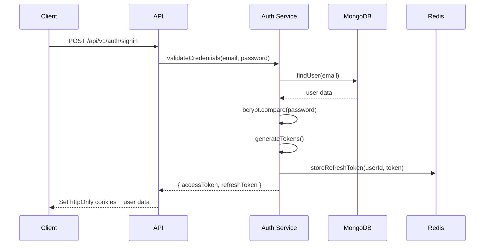
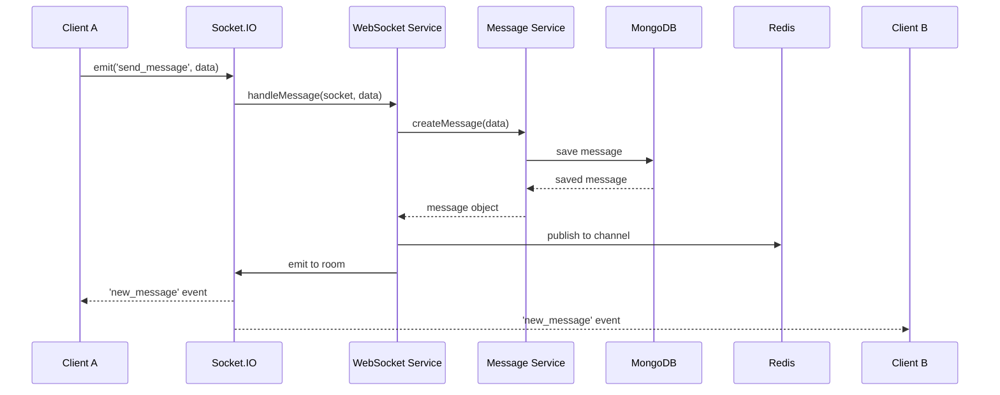
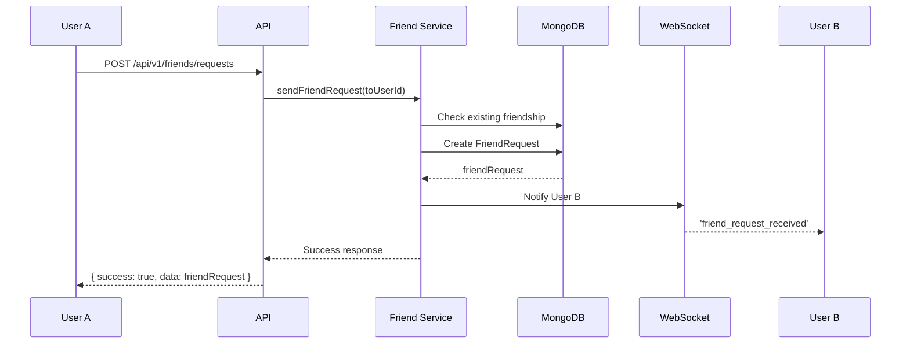
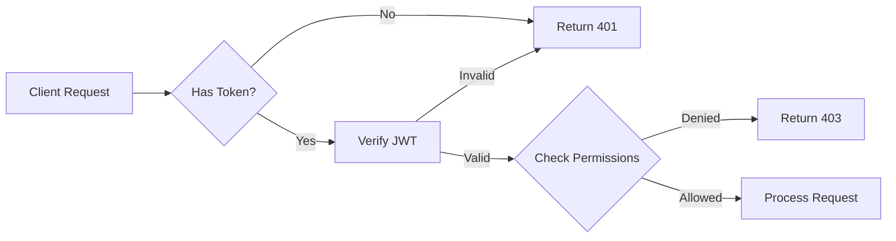
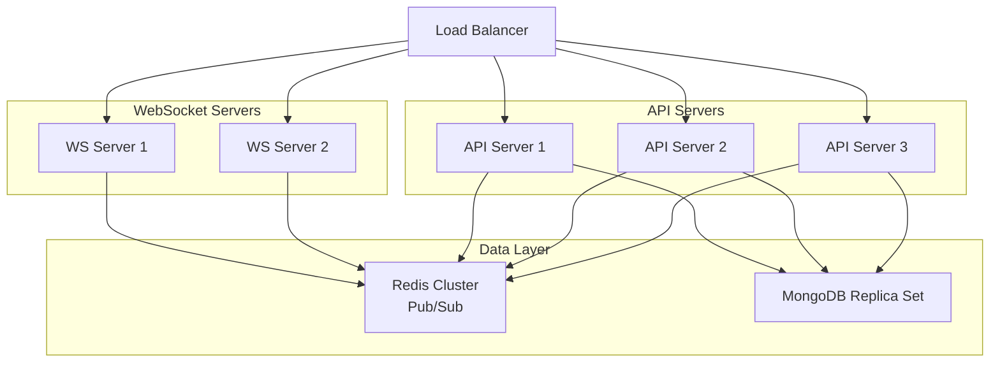

# System Architecture

> **Last Updated:** 2025-12-22  
> **Version:** 1.0.0  
> **Maintainer:** EricNguyen1206

## 📋 Table of Contents

- [Overview](#overview)
- [High-Level Architecture](#high-level-architecture)
- [Monorepo Structure](#monorepo-structure)
- [Technology Stack](#technology-stack)
- [Data Flow](#data-flow)
- [Security Architecture](#security-architecture)
- [Scalability Considerations](#scalability-considerations)
- [Related Documentation](#related-documentation)

---

## 🎯 Overview

**erion-raven** is a real-time chat application built with a modern monorepo architecture. The system supports:

- ✅ Real-time messaging with WebSocket (Socket.IO)
- ✅ Direct messages (1-1 chat)
- ✅ Group conversations
- ✅ Friend request system
- ✅ User authentication with JWT
- ✅ Rate limiting and security features

---

## 🏗️ High-Level Architecture

```mermaid
graph TB
    subgraph "Client Layer"
        WEB[Web App<br/>React + Vite]
    end
    
    subgraph "API Gateway"
        API[Express API Server<br/>Port 8080]
        WS[Socket.IO Server<br/>WebSocket]
    end
    
    subgraph "Services Layer"
        AUTH[Auth Service]
        USER[User Service]
        CONV[Conversation Service]
        MSG[Message Service]
        FRIEND[Friend Service]
        WSVC[WebSocket Service]
        STORAGE[Storage Service]
    end
    
    subgraph "Data Layer"
        MONGO[(MongoDB<br/>Primary Database)]
        REDIS[(Redis<br/>Cache & Sessions)]
        S3[(Object Storage)]
    end
    
    WEB -->|HTTP/HTTPS| API
    WEB -->|WebSocket| WS
    
    API --> AUTH
    API --> USER
    API --> CONV
    API --> MSG
    API --> FRIEND
    API --> STORAGE
    
    WS --> WSVC
    
    AUTH --> MONGO
    AUTH --> REDIS
    USER --> MONGO
    CONV --> MONGO
    MSG --> MONGO
    FRIEND --> MONGO
    WSVC --> REDIS
    STORAGE --> S3
    
    style WEB fill:#61dafb
    style API fill:#68a063
    style WS fill:#010101
    style MONGO fill:#47a248
    style REDIS fill:#dc382d
    style S3 fill:#e34c26
```



---

## 📦 Monorepo Structure

```
erion-raven/
├── apps/
│   ├── api/                    # Backend API (Node.js + Express)
│   │   ├── src/
│   │   │   ├── config/        # Configuration files
│   │   │   ├── controllers/   # Request handlers
│   │   │   ├── middleware/    # Express middleware
│   │   │   ├── models/        # Mongoose models
│   │   │   ├── routes/        # API routes
│   │   │   ├── services/      # Business logic
│   │   │   ├── utils/         # Utilities
│   │   │   └── index.ts       # Entry point
│   │   └── package.json
│   │
│   └── web/                    # Frontend (React + Vite)
│       ├── src/
│       │   ├── components/    # React components
│       │   │   ├── atoms/     # Basic UI elements
│       │   │   ├── molecules/ # Composite components
│       │   │   ├── organisms/ # Complex components
│       │   │   ├── templates/ # Layout templates
│       │   │   └── ui/        # shadcn/ui components
│       │   ├── guards/        # Route guards
│       │   ├── hooks/         # Custom React hooks
│       │   ├── lib/           # Libraries & utilities
│       │   ├── pages/         # Page components
│       │   ├── services/      # API services
│       │   ├── store/         # Zustand stores
│       │   └── App.tsx
│       └── package.json
│
├── packages/
│   ├── config/                 # Shared configs (ESLint, Prettier, TS)
│   │   ├── eslint/
│   │   ├── jest/
│   │   ├── prettier/
│   │   └── tsconfig/
│   │
│   ├── shared/                 # Shared utilities
│   │   └── src/
│   │       ├── constants.ts
│   │       ├── errors.ts
│   │       └── helpers.ts
│   │
│   ├── types/                  # Shared TypeScript types
│   │   └── src/
│   │       ├── user.ts
│   │       ├── conversation.ts
│   │       ├── message.ts
│   │       ├── friend.ts
│   │       └── socket.ts
│   │
│   └── validators/             # Shared validation schemas
│       └── src/
│           ├── auth.dto.ts
│           ├── conversation.dto.ts
│           ├── friend.dto.ts
│           └── message.dto.ts
│
├── _docs/                      # Documentation
│   ├── ARCHITECTURE.md         # This file
│   ├── API_DESIGN.md          # API documentation
│   ├── DATABASE_SCHEMA.md     # Database schema
│   ├── WEBSOCKET_EVENTS.md    # WebSocket events
│   ├── DEPLOYMENT.md          # Deployment guide
│   ├── DEVELOPMENT.md         # Development setup
│   └── TESTING.md             # Testing guide
│
├── .github/
│   └── workflows/              # CI/CD pipelines
│
├── docker-compose.yml          # Docker setup
├── Makefile                    # Build commands
├── pnpm-workspace.yaml         # PNPM workspace config
├── turbo.json                  # Turborepo config
└── package.json                # Root package.json
```

### 📂 Key Directories Explained

| Directory | Purpose | Key Files |
|-----------|---------|-----------|
| `apps/api` | Backend REST API & WebSocket server | `index.ts`, controllers, services |
| `apps/web` | Frontend React application | `App.tsx`, components, pages |
| `packages/types` | Shared TypeScript type definitions | `user.ts`, `message.ts`, `socket.ts` |
| `packages/validators` | Shared validation schemas (Zod) | `*.dto.ts` files |
| `packages/config` | Shared configuration (ESLint, TS, etc.) | Config files |
| `_docs` | Project documentation | Markdown files |

---

## 🛠️ Technology Stack

### Backend (`apps/api`)

| Technology | Version | Purpose |
|------------|---------|---------|
| **Node.js** | 18+ | Runtime environment |
| **TypeScript** | 5.x | Type-safe JavaScript |
| **Express.js** | 4.x | Web framework |
| **MongoDB** | 6.x | Primary database |
| **Mongoose** | 8.x | MongoDB ODM |
| **Redis** | 7.x | Cache & session store |
| **Socket.IO** | 4.x | WebSocket server |
| **JWT** | 9.x | Authentication tokens |
| **Bcrypt** | 5.x | Password hashing |
| **Zod** | 3.x | Schema validation |
| **Winston** | 3.x | Logging |

### Frontend (`apps/web`)

| Technology | Version | Purpose |
|------------|---------|---------|
| **React** | 18.x | UI library |
| **TypeScript** | 5.x | Type safety |
| **Vite** | 5.x | Build tool |
| **React Router** | 6.x | Routing |
| **Zustand** | 4.x | State management |
| **TanStack Query** | 5.x | Data fetching |
| **Socket.IO Client** | 4.x | WebSocket client |
| **Axios** | 1.x | HTTP client |
| **shadcn/ui** | Latest | UI components |
| **Tailwind CSS** | 3.x | Styling |

### DevOps & Tools

| Tool | Purpose |
|------|---------|
| **PNPM** | Package manager |
| **Turborepo** | Monorepo build system |
| **Docker** | Containerization |
| **GitHub Actions** | CI/CD |
| **ESLint** | Code linting |
| **Prettier** | Code formatting |
| **Jest** | Unit testing |
| **Vitest** | Frontend testing |

---

## 🔄 Data Flow

### 1. Authentication Flow



### 2. Real-time Messaging Flow



### 3. Friend Request Flow



---

## 🔐 Security Architecture

### Authentication & Authorization



### Security Layers

1. **Transport Security**
   - HTTPS/TLS encryption
   - Secure WebSocket (WSS)
   - CORS configuration

2. **Authentication**
   - JWT access tokens (15min expiry)
   - Refresh tokens (7 days expiry)
   - httpOnly cookies
   - Token rotation

3. **Authorization**
   - Role-based access control
   - Resource ownership validation
   - Conversation membership checks

4. **Input Validation**
   - Zod schema validation
   - Request body sanitization
   - SQL injection prevention (via Mongoose)
   - XSS protection

5. **Rate Limiting**
   - Redis-based rate limiter
   - Auth endpoints: 5 req/15min
   - General endpoints: 100 req/15min
   - WebSocket connections: 1/user

6. **Password Security**
   - Bcrypt hashing (10 rounds)
   - Minimum 8 characters
   - Password strength validation

---

## 📊 Scalability Considerations

### Horizontal Scaling



### Performance Optimizations

1. **Caching Strategy**
   - User sessions in Redis
   - Conversation metadata caching
   - Rate limit counters in Redis

2. **Database Optimization**
   - MongoDB indexes on frequently queried fields
   - Pagination for message lists
   - Aggregation pipelines for complex queries

3. **WebSocket Optimization**
   - Redis Pub/Sub for multi-server WebSocket
   - Room-based message broadcasting
   - Connection pooling

4. **API Optimization**
   - Response compression (gzip)
   - Request batching where possible
   - Lazy loading for large datasets

---

## 📚 Related Documentation

- **[API Design](./API_DESIGN.md)** - REST API endpoints documentation
- **[Database Schema](./DATABASE_SCHEMA.md)** - MongoDB collections and relationships
- **[WebSocket Events](./WEBSOCKET_EVENTS.md)** - Real-time event specifications
- **[Deployment Guide](./DEPLOYMENT.md)** - Production deployment instructions
- **[Development Setup](./DEVELOPMENT.md)** - Local development environment
- **[Testing Guide](./TESTING.md)** - Testing strategies and examples

---

## 🔄 Version History

| Version | Date | Changes |
|---------|------|---------|
| 1.0.0 | 2025-12-22 | Initial architecture documentation |

---

## 📞 Support

For questions or issues:
- **GitHub Issues:** [erion-raven/issues](https://github.com/EricNguyen1206/erion-raven/issues)
- **Email:** eric.nguyen@example.com
