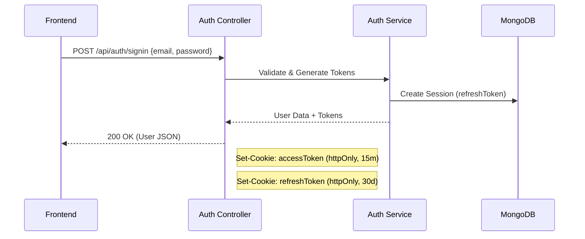
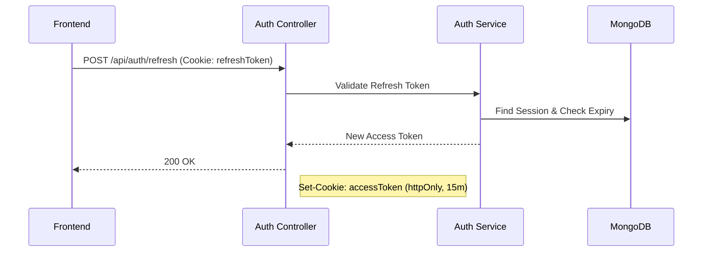
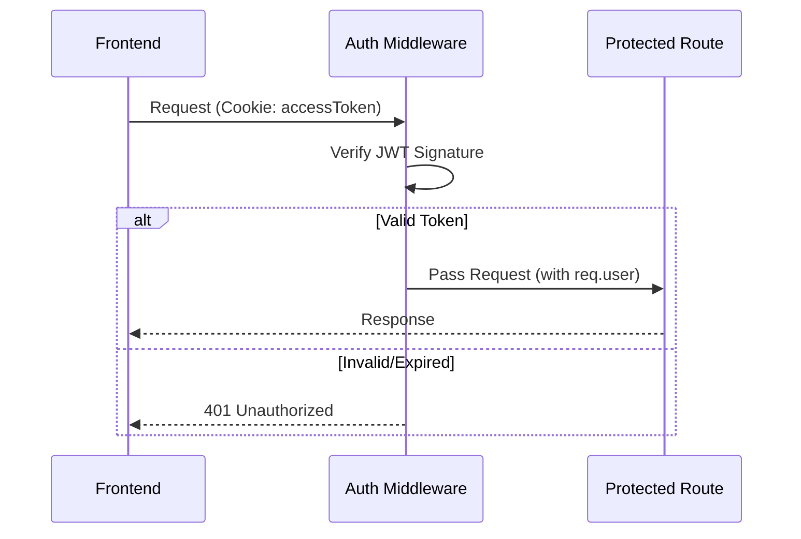

# Authentication Feature Flow

> **Last Updated:** 2026-01-04
> **Feature:** Authentication & Session Management
> **Components:** JWT, HttpOnly Cookies, API, Middleware
> **Status:** Implemented

This document details the secure authentication mechanism used in the Erion Raven application, which relies on JWTs stored in HTTP-Only cookies and a session-based refresh token system.

## Overview

The authentication system is designed to be secure and stateless (for access) while maintaining control over long-term sessions.

- **Access Token:** Short-lived (15 minutes), stateless JWT used for API authorization. Stored in an `httpOnly` cookie.
- **Refresh Token:** Long-lived (30 days), stateful token stored in the database (`Session` collection) and an `httpOnly` cookie. Used to obtain new access tokens.
- **Security:** CSRF protection via SameSite cookies (`lax` in dev, `strict`/`lax` in prod). XSS protection by making cookies inaccessible to JavaScript.

## Architecture & Data Flow

### 1. Sign Up & Sign In Flow



### 2. Token Refresh Flow

This happens automatically when the frontend detects a 401 or preemptively refreshes.



### 3. Authenticated Request Flow



## Database Schema

### User Collection
The core identity record.

```typescript
interface IUser {
  _id: ObjectId;
  username: string;   // Unique
  email: string;      // Unique
  password: string;   // Bcrypt hash
  avatar?: string;
  createdAt: Date;
  updatedAt: Date;
}
```

### Session Collection
Manages active refresh tokens. Allowing multiple active sessions per user (e.g., phone + laptop).

```typescript
interface ISession {
  _id: ObjectId;
  userId: ObjectId;   // Reference to User
  refreshToken: string;
  expiresAt: Date;
  createdAt: Date;
}
```

## API Endpoints

All auth endpoints are under `/api/auth`.

## API Endpoints

Base Route: `/api/v1/auth`

| Route | Endpoint | Description | Method | Request | Response | Errors |
|-------|----------|-------------|--------|---------|----------|--------|
| `/signup` | `/api/v1/auth/signup` | Register a new user | `POST` | `{ email, username, password }` | `{ success: true, data: { user, tokens } }` | `409` Email exists, `500` Failed |
| `/signin` | `/api/v1/auth/signin` | Sign in a user | `POST` | `{ email, password }` | `{ success: true, data: user }` | `401` Invalid credentials |
| `/refresh` | `/api/v1/auth/refresh` | Refresh access token | `POST` | None (cookie) | `{ success: true }` | `401` Invalid token |
| `/signout` | `/api/v1/auth/signout` | Sign out a user | `POST` | None (cookie) | `{ success: true }` | `401` Not authenticated |

## Code Examples

### Backend: Setting Cookies (Controller)

**File:** `apps/api/src/controllers/auth.controller.ts`

```typescript
public signin = async (req: Request, res: Response) => {
  const result = await this.authService.signin(req.body);

  const cookieOptions = {
    httpOnly: true,
    secure: process.env.NODE_ENV === 'production',
    sameSite: 'lax',
    path: '/',
    maxAge: 15 * 60 * 1000 // 15 mins
  };

  // Set cookies
  res.cookie('accessToken', result.accessToken, cookieOptions);
  res.cookie('refreshToken', result.refreshToken, { ...cookieOptions, maxAge: 30 * 24 * 60 * 60 * 1000 });

  res.json({ success: true, data: result.user });
};
```

### Backend: Middleware Verification

**File:** `apps/api/src/middleware/auth.middleware.ts`

```typescript
export const authenticateToken = async (req: AuthenticatedRequest, res: Response, next: NextFunction) => {
  // 1. Try cookie first
  let token = req.cookies?.['accessToken'];
  
  // 2. Fallback to Header (Bearer)
  if (!token) {
    const authHeader = req.headers.authorization;
    token = authHeader && authHeader.split(' ')[1];
  }

  if (!token) return res.status(401).json({ message: 'Unauthorized' });

  try {
    const decoded = jwt.verify(token, config.jwt.secret) as any;
    req.userId = decoded.userId;
    next();
  } catch (error) {
    res.status(401).json({ message: 'Invalid token' });
  }
};
```

### Frontend: Fetch with Credentials

**File:** `apps/web/src/services/api/client.ts` (Example usage)

```typescript
// Important: 'credentials: include' must be set to send httpOnly cookies
const response = await fetch(`${apiUrl}/protected-route`, {
  method: 'GET',
  credentials: 'include', // <--- CRITICAL
  headers: {
    'Content-Type': 'application/json'
  }
});
```

## Related Documentation

- **[Database Schema](./DATABASE_SCHEMA.md)** - Full User schema details

