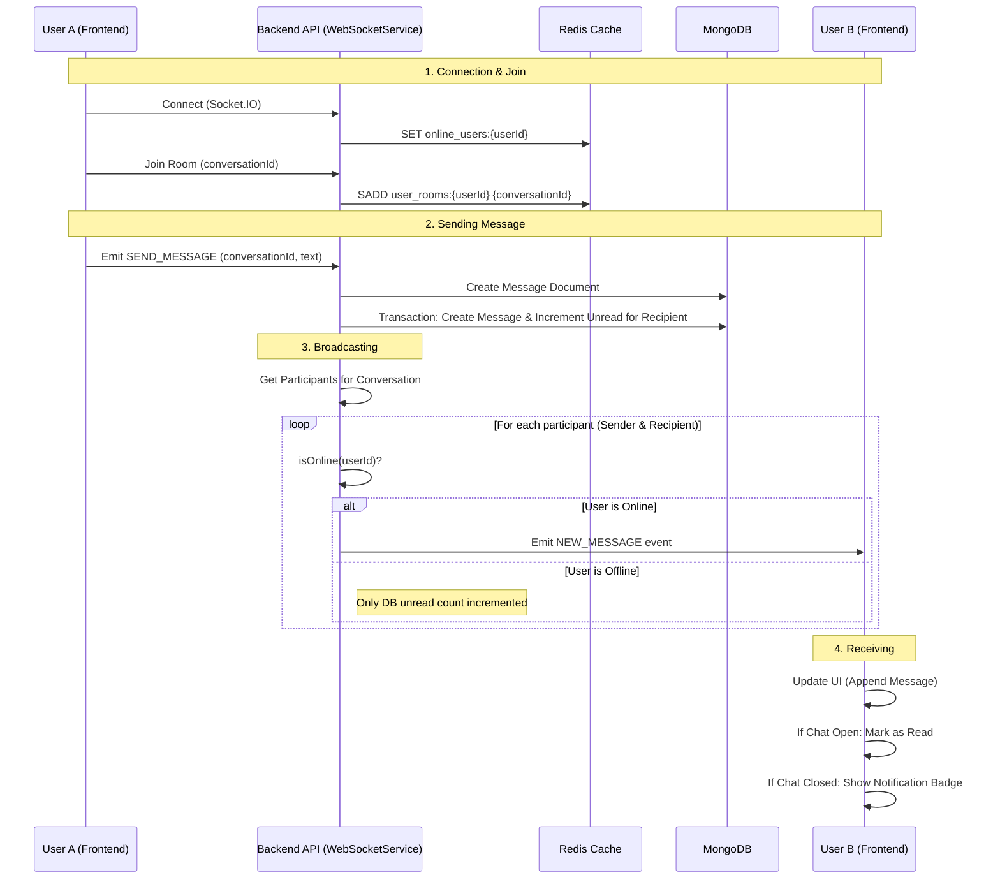
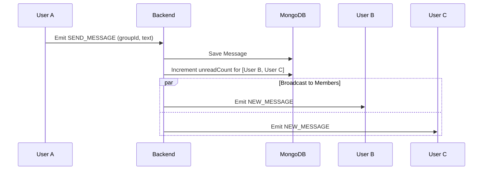

# Real-time Chat Feature Flow

> **Last Updated:** 2026-01-04
> **Feature:** Real-time Messaging (1-1 & Group)
> **Components:** WebSocket, Redis, MongoDB, API
> **Status:** Implemented

This document details the architecture and implementation of the real-time chat features, including direct (1-1) and group conversations.

## Overview

The real-time chat system is built on **Socket.IO** for real-time bidirectional event-based communication. It uses **Redis** to maintain user presence and conversation state across potential multiple server instances, and **MongoDB** for persistent storage of messages and reliable delivery.

## Architecture & Data Flow

### 1. Direct Chat (1-1) Flow

The flow for sending a direct message ensures that both the sender and the recipient receive the message in real-time if online.



### 2. Group Chat Flow

Group chat works similarly but involves broadcasting to multiple recipients.



## Redis Data Structures

We use Redis to track online status and active conversation participation.

| Key Pattern | Data Type | Purpose | TTL |
| :--- | :--- | :--- | :--- |
| `online_users:{userId}` | String (Timestamp) | Tracks if a user is online and their last heartbeat | 24h |
| `user_rooms:{userId}` | Set | List of conversation IDs the user has actively joined (opened) | N/A |
| `conversation_participants:{convId}` | Set | List of users currently viewing a specific conversation | N/A |

### Key Operations

- **Set User Online:** `SET online_users:{userId} {timestamp}`
- **Set User Offline:** `DEL online_users:{userId}`
- **Join Conversation:**
  - `SADD user_rooms:{userId} {conversationId}`
  - `SADD conversation_participants:{conversationId} {userId}`
- **Leave Conversation:**
  - `SREM user_rooms:{userId} {conversationId}`
  - `SREM conversation_participants:{conversationId} {userId}`

### Message Management

Base Route: `/api/v1/messages`

| Endpoint | Method | Description | Request | Response | Errors |
|----------|--------|-------------|---------|----------|--------|
| `/` | `POST` | Send message | `{ conversationId\|receiverId, text?, url? }` | `{ data: message }` | `400` Invalid |
| `/conversation/:id` | `GET` | Get history | Params: `id`, Query: `limit`, `before` | `{ data: messages[], pagination }` | `404` Conv not found |
| `/friend/:friendId` | `GET` | Get direct chat with friend | Params: `friendId` | `{ data: messages[] }` | `404` Not found |
| `/:id` | `GET` | Get message by ID | Params: `id` | `{ data: message }` | `404` Not found |
| `/:id` | `DELETE` | Delete message | Params: `id` | `{ success: true }` | `403` Not owner |

### WebSocket Management

Base Route: `/api/v1/ws`

| Endpoint | Method | Description | Request | Response |
|----------|--------|-------------|---------|----------|
| `/stats` | `GET` | System stats | None | `{ data: { connectedUsers } }` |
| `/conversations/:id/participants` | `GET` | Get active room users | Params: `id` | `{ data: { participants } }` |
| `/conversations/:id/broadcast` | `POST` | Admin broadcast | `{ message }` | `{ success: true }` |
| `/users` | `GET` | List connected users | None | `{ data: { users[] } }` |
| `/users/:id` | `DELETE` | Kick user | Params: `id` | `{ success: true }` |

## Code Examples

### Backend: WebSocket Service (Broadcasting)

**File:** `apps/api/src/services/websocket.service.ts`

```typescript
// Sending a message and notifying all online participants
async handleSendMessage(senderId: string, messageData: any) {
  // 1. Save to DB
  const savedMessage = await this.messageService.createMessage(senderId, messageData);
  
  // 2. Increment Unread Counts
  await Participant.updateMany(
    { conversationId, userId: { $ne: senderId } },
    { $inc: { unreadCount: 1 } }
  );

  // 3. Broadcast to Online Users
  const participants = await Participant.find({ conversationId });
  for (const p of participants) {
    if (this.isOnline(p.userId)) {
      this.emitToUser(p.userId, 'new_message', savedMessage);
    }
  }
}
```

### Frontend: React Integration

**File:** `apps/web/src/hooks/useChatPage.tsx`

```typescript
// Listening for new messages
useWebSocketMessageHandler(currentConversation?.id);

// Auto-scroll on new message
useEffect(() => {
  if (chats && chats.length > 0) {
    const lastMessage = chats[chats.length - 1];
    if (lastMessage.id !== lastMessageIdRef.current) {
      scrollToBottomOnUpdate();
    }
  }
}, [chats, scrollToBottomOnUpdate]);
```

## Related Documentation

- **[Unread Message Feature](./UNREAD_MESSAGE_FEATURE.md)** - Details on unread count logic
- **[Database Schema](./DATABASE_DESIGN.md)** - Message and Conversation models
