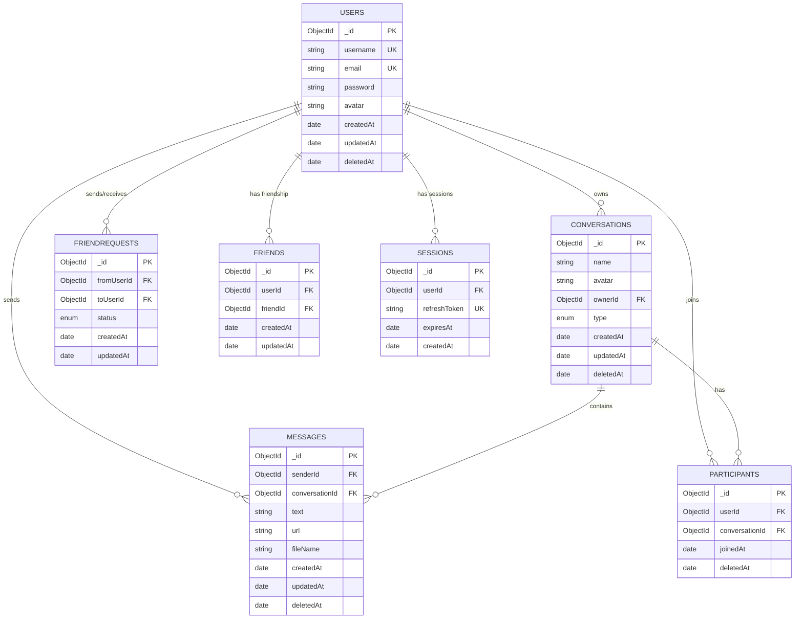
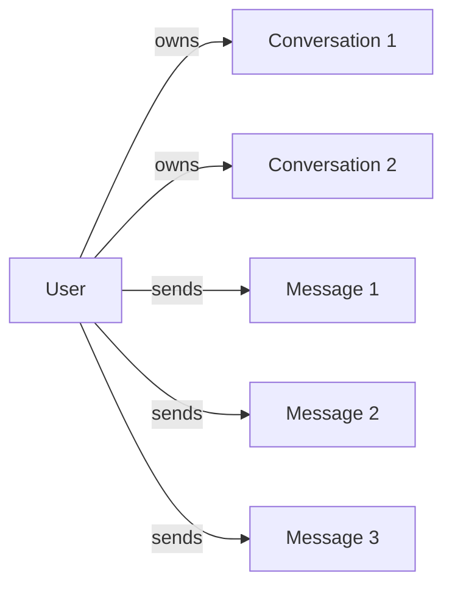
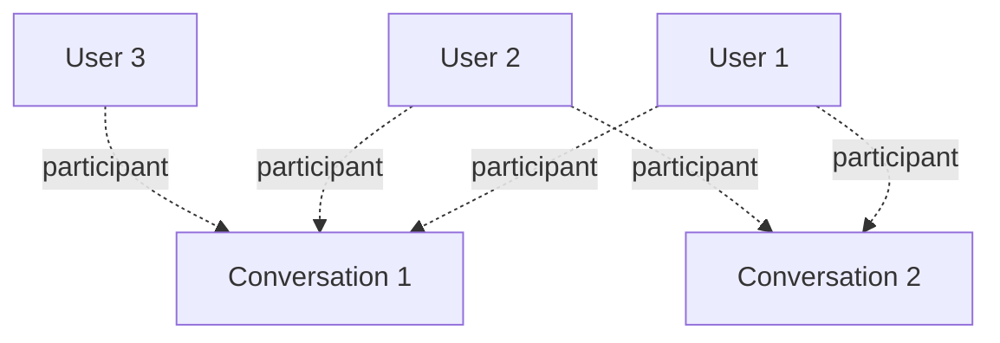

# Database Schema

> **Last Updated:** 2026-01-04
> **Feature:** Database Design & Schema
> **Components:** MongoDB, Mongoose
> **Status:** Implemented

## 📋 Table of Contents

- [Overview](#overview)
- [Collections](#collections)
- [Entity Relationship Diagram](#entity-relationship-diagram)
- [Collection Details](#collection-details)
- [Indexes](#indexes)
- [Relationships](#relationships)
- [Data Validation](#data-validation)
- [Migration Strategy](#migration-strategy)

---

## 🎯 Overview

The **erion-raven** application uses MongoDB as its primary database with Mongoose as the ODM (Object Document Mapper). The schema is designed to support:

- User authentication and profiles
- Real-time messaging
- Direct and group conversations
- Friend request system
- Session management

### Design Principles

- **Soft Deletes:** Most collections use `deletedAt` field for soft deletion
- **Timestamps:** All collections have `createdAt` and `updatedAt` fields
- **Indexes:** Strategic indexing for query optimization
- **References:** ObjectId references for relationships
- **Virtuals:** Virtual `id` field for consistency

---

## 📊 Collections

| Collection | Documents | Purpose | Key Relationships |
|------------|-----------|---------|-------------------|
| `users` | User accounts | Store user credentials and profiles | Referenced by all other collections |
| `conversations` | Chat rooms | Store conversation metadata | References `users` (owner) |
| `messages` | Chat messages | Store message content | References `users` (sender), `conversations` |
| `participants` | Conversation members | Track conversation membership | References `users`, `conversations` |
| `friendrequests` | Friend requests | Manage friend request lifecycle | References `users` (from/to) |
| `friends` | Friendships | Store confirmed friendships | References `users` (bidirectional) |
| `sessions` | User sessions | Manage refresh tokens | References `users` |

---

## 🗺️ Entity Relationship Diagram



---

## 📝 Collection Details

### 1. Users Collection

**Collection Name:** `users`

**Purpose:** Store user account information and authentication credentials.

**Schema:**

```typescript
{
  _id: ObjectId,              // Primary key (auto-generated)
  username: string,           // Unique username
  email: string,              // Unique email address
  password: string,           // Bcrypt hashed password
  avatar?: string,            // Avatar URL (optional)
  createdAt: Date,            // Auto-generated timestamp
  updatedAt: Date,            // Auto-updated timestamp
  deletedAt?: Date | null     // Soft delete timestamp
}
```

**Indexes:**
- `username` (unique)
- `email` (unique)
- `deletedAt` (for soft delete queries)

**Validation Rules:**
- `username`: Required, unique, 3-30 characters
- `email`: Required, unique, valid email format
- `password`: Required, minimum 8 characters (hashed with bcrypt)

**Example Document:**
```json
{
  "_id": "507f1f77bcf86cd799439011",
  "username": "johndoe",
  "email": "john@example.com",
  "password": "$2b$10$...",
  "avatar": "https://example.com/avatars/john.jpg",
  "createdAt": "2025-12-22T10:00:00.000Z",
  "updatedAt": "2025-12-22T10:00:00.000Z",
  "deletedAt": null
}
```

---

### 2. Conversations Collection

**Collection Name:** `conversations`

**Purpose:** Store conversation metadata for both direct and group chats.

**Schema:**

```typescript
{
  _id: ObjectId,              // Primary key
  name: string,               // Conversation name
  avatar?: string,            // Conversation avatar (optional)
  ownerId: ObjectId,          // Reference to User (creator/owner)
  type: 'direct' | 'group',   // Conversation type
  createdAt: Date,            // Auto-generated
  updatedAt: Date,            // Auto-updated
  deletedAt?: Date | null     // Soft delete
}
```

**Indexes:**
- `ownerId` (for owner queries)
- `type` (for filtering by type)
- `deletedAt` (for soft delete queries)

**Validation Rules:**
- `name`: Required, 1-100 characters
- `ownerId`: Required, must reference existing User
- `type`: Required, must be 'direct' or 'group'

**Example Document:**
```json
{
  "_id": "507f1f77bcf86cd799439012",
  "name": "Team Discussion",
  "avatar": "https://example.com/groups/team.jpg",
  "ownerId": "507f1f77bcf86cd799439011",
  "type": "group",
  "createdAt": "2025-12-22T10:00:00.000Z",
  "updatedAt": "2025-12-22T10:00:00.000Z",
  "deletedAt": null
}
```

---

### 3. Messages Collection

**Collection Name:** `messages`

**Purpose:** Store all chat messages (text, files, etc.).

**Schema:**

```typescript
{
  _id: ObjectId,              // Primary key
  senderId: ObjectId,         // Reference to User (sender)
  conversationId?: ObjectId,  // Reference to Conversation (optional)
  text?: string,              // Message text content (optional)
  url?: string,               // File URL (optional)
  fileName?: string,          // Original file name (optional)
  createdAt: Date,            // Auto-generated
  updatedAt: Date,            // Auto-updated
  deletedAt?: Date | null     // Soft delete
}
```

**Indexes:**
- `{ conversationId: 1, createdAt: -1 }` (compound, for pagination)
- `senderId` (for sender queries)
- `deletedAt` (for soft delete queries)

**Validation Rules:**
- `senderId`: Required, must reference existing User
- At least one of `text`, `url`, or `fileName` must be present

**Example Document:**
```json
{
  "_id": "507f1f77bcf86cd799439013",
  "senderId": "507f1f77bcf86cd799439011",
  "conversationId": "507f1f77bcf86cd799439012",
  "text": "Hello, team!",
  "createdAt": "2025-12-22T10:05:00.000Z",
  "updatedAt": "2025-12-22T10:05:00.000Z",
  "deletedAt": null
}
```

---

### 4. Participants Collection

**Collection Name:** `participants`

**Purpose:** Track which users are members of which conversations.

**Schema:**

```typescript
{
  _id: ObjectId,              // Primary key
  userId: ObjectId,           // Reference to User
  conversationId: ObjectId,   // Reference to Conversation
  joinedAt: Date,             // When user joined (default: now)
  unreadCount: number,        // Number of unread messages for this user in this conversation
  lastReadAt?: Date,          // Timestamp of when the user last read the conversation
  deletedAt?: Date | null     // Soft delete (when user left)
}
```

**Indexes:**
- `{ userId: 1, conversationId: 1 }` (compound unique, prevents duplicates)
- `conversationId` (for conversation member queries)

**Validation Rules:**
- `userId`: Required, must reference existing User
- `conversationId`: Required, must reference existing Conversation
- Unique combination of `userId` and `conversationId`

**Example Document:**
```json
{
  "_id": "507f1f77bcf86cd799439014",
  "userId": "507f1f77bcf86cd799439011",
  "conversationId": "507f1f77bcf86cd799439012",
  "joinedAt": "2025-12-22T10:00:00.000Z",
  "deletedAt": null
}
```

---

### 5. FriendRequests Collection

**Collection Name:** `friendrequests`

**Purpose:** Manage friend request lifecycle (pending, accepted, declined).

**Schema:**

```typescript
{
  _id: ObjectId,              // Primary key
  fromUserId: ObjectId,       // Reference to User (requester)
  toUserId: ObjectId,         // Reference to User (recipient)
  status: 'pending' | 'accepted' | 'declined',
  createdAt: Date,            // Auto-generated
  updatedAt: Date             // Auto-updated
}
```

**Indexes:**
- `{ fromUserId: 1, toUserId: 1 }` (compound unique, one request per pair)
- `status` (for filtering by status)
- `{ toUserId: 1, status: 1 }` (compound, for user's incoming requests)

**Validation Rules:**
- `fromUserId`: Required, must reference existing User
- `toUserId`: Required, must reference existing User
- `fromUserId` cannot equal `toUserId`
- `status`: Required, must be 'pending', 'accepted', or 'declined'

**Example Document:**
```json
{
  "_id": "507f1f77bcf86cd799439015",
  "fromUserId": "507f1f77bcf86cd799439011",
  "toUserId": "507f1f77bcf86cd799439016",
  "status": "pending",
  "createdAt": "2025-12-22T10:00:00.000Z",
  "updatedAt": "2025-12-22T10:00:00.000Z"
}
```

---

### 6. Friends Collection

**Collection Name:** `friends`

**Purpose:** Store confirmed friendships between users.

**Schema:**

```typescript
{
  _id: ObjectId,              // Primary key
  userId: ObjectId,           // Reference to User (always smaller ID)
  friendId: ObjectId,         // Reference to User (always larger ID)
  createdAt: Date,            // Auto-generated
  updatedAt: Date             // Auto-updated
}
```

**Indexes:**
- `{ userId: 1, friendId: 1 }` (compound unique, prevents duplicates)

**Special Behavior:**
- Pre-save hook ensures `userId` < `friendId` (consistent ordering)
- This prevents duplicate friendships (A-B and B-A)

**Validation Rules:**
- `userId`: Required, must reference existing User
- `friendId`: Required, must reference existing User
- `userId` cannot equal `friendId`

**Example Document:**
```json
{
  "_id": "507f1f77bcf86cd799439017",
  "userId": "507f1f77bcf86cd799439011",
  "friendId": "507f1f77bcf86cd799439016",
  "createdAt": "2025-12-22T10:10:00.000Z",
  "updatedAt": "2025-12-22T10:10:00.000Z"
}
```

---

### 7. Sessions Collection

**Collection Name:** `sessions`

**Purpose:** Manage user refresh tokens for JWT authentication.

**Schema:**

```typescript
{
  _id: ObjectId,              // Primary key
  userId: ObjectId,           // Reference to User
  refreshToken: string,       // JWT refresh token (unique)
  expiresAt: Date,            // Token expiration date
  createdAt: Date             // Auto-generated
}
```

**Indexes:**
- `userId` (for user session queries)
- `refreshToken` (unique, for token lookup)
- `expiresAt` (for cleanup of expired sessions)

**Instance Methods:**
- `isExpired()`: Returns boolean indicating if session is expired

**Validation Rules:**
- `userId`: Required, must reference existing User
- `refreshToken`: Required, unique
- `expiresAt`: Required, must be future date

**Example Document:**
```json
{
  "_id": "507f1f77bcf86cd799439018",
  "userId": "507f1f77bcf86cd799439011",
  "refreshToken": "eyJhbGciOiJIUzI1NiIsInR5cCI6IkpXVCJ9...",
  "expiresAt": "2025-12-29T10:00:00.000Z",
  "createdAt": "2025-12-22T10:00:00.000Z"
}
```

---

## 🔍 Indexes

### Performance Indexes

Strategic indexes are created for optimal query performance:

| Collection | Index | Type | Purpose |
|------------|-------|------|---------|
| `users` | `username` | Unique | Fast user lookup by username |
| `users` | `email` | Unique | Fast user lookup by email |
| `users` | `deletedAt` | Single | Soft delete filtering |
| `conversations` | `ownerId` | Single | Find conversations by owner |
| `conversations` | `type` | Single | Filter by conversation type |
| `conversations` | `deletedAt` | Single | Soft delete filtering |
| `messages` | `{ conversationId: 1, createdAt: -1 }` | Compound | Paginated message retrieval |
| `messages` | `senderId` | Single | Find messages by sender |
| `messages` | `deletedAt` | Single | Soft delete filtering |
| `participants` | `{ userId: 1, conversationId: 1 }` | Compound Unique | Prevent duplicate memberships |
| `participants` | `conversationId` | Single | Find all conversation members |
| `friendrequests` | `{ fromUserId: 1, toUserId: 1 }` | Compound Unique | One request per user pair |
| `friendrequests` | `status` | Single | Filter by request status |
| `friendrequests` | `{ toUserId: 1, status: 1 }` | Compound | User's incoming requests |
| `friends` | `{ userId: 1, friendId: 1 }` | Compound Unique | Prevent duplicate friendships |
| `sessions` | `userId` | Single | Find user sessions |
| `sessions` | `refreshToken` | Unique | Fast token lookup |
| `sessions` | `expiresAt` | Single | Cleanup expired sessions |

---

## 🔗 Relationships

### One-to-Many Relationships



- One User can own many Conversations
- One User can send many Messages
- One User can have many Sessions
- One Conversation can have many Messages
- One Conversation can have many Participants

### Many-to-Many Relationships



- Users and Conversations (via Participants collection)
- Users and Users (via Friends collection)

### Relationship Queries

**Get all conversations for a user:**
```javascript
const participants = await Participant.find({ userId, deletedAt: null });
const conversationIds = participants.map(p => p.conversationId);
const conversations = await Conversation.find({ _id: { $in: conversationIds } });
```

**Get all messages in a conversation:**
```javascript
const messages = await Message.find({ 
  conversationId, 
  deletedAt: null 
})
.sort({ createdAt: -1 })
.limit(20);
```

**Get user's friends:**
```javascript
const friendships = await Friends.find({
  $or: [{ userId }, { friendId: userId }]
});
```

---

## ✅ Data Validation

### Application-Level Validation

Validation is performed using **Zod** schemas before data reaches the database:

**Example: User Registration**
```typescript
const SignupSchema = z.object({
  username: z.string().min(3).max(30),
  email: z.string().email(),
  password: z.string().min(8)
});
```

### Database-Level Validation

Mongoose schemas provide additional validation:

- **Required fields:** Enforced by `required: true`
- **Unique constraints:** Enforced by unique indexes
- **Enum validation:** For fields like `type`, `status`
- **Custom validators:** For complex validation logic

---

## 🔄 Migration Strategy

### Initial Setup

```bash
# MongoDB will auto-create collections on first insert
# Indexes are created automatically by Mongoose on application start
```

### Schema Changes

When modifying the schema:

1. **Add new fields:** MongoDB is schema-less, new fields can be added anytime
2. **Remove fields:** Use `$unset` operator to remove from existing documents
3. **Rename fields:** Use `$rename` operator
4. **Change field types:** Requires data migration script

**Example Migration Script:**
```javascript
// Add new field to all users
await User.updateMany({}, { $set: { newField: defaultValue } });

// Rename field
await User.updateMany({}, { $rename: { oldName: 'newName' } });

// Remove field
await User.updateMany({}, { $unset: { fieldToRemove: '' } });
```

### Backup Strategy

```bash
# Backup entire database
mongodump --uri="mongodb://localhost:27017/erion-raven" --out=/backup/

# Restore database
mongorestore --uri="mongodb://localhost:27017/erion-raven" /backup/erion-raven/
```

---

## 📚 Related Documentation

- **[Architecture](./HIGH_LEVEL_DESIGN.md)** - System architecture overview

- **[Chat Realtime Feature](./CHAT_REALTIME_FEATURE.md)** - Real-time events
- **[Deployment Guide](./DEPLOYMENT.md)** - Local setup

---

## 🔄 Version History

| Version | Date | Changes |
|---------|------|---------|
| 1.0.0 | 2025-12-22 | Initial database schema documentation |

---

## 📞 Support

For questions about the database schema:
- **GitHub Issues:** [erion-raven/issues](https://github.com/EricNguyen1206/erion-raven/issues)
- **Email:** eric.nguyen@example.com
