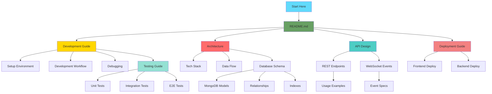

# 📚 Documentation Index

> **Erion Raven** - Real-time Chat Application Documentation  
> **Last Updated:** 2025-12-22  
> **Version:** 1.0.0

Welcome to the **erion-raven** documentation! This index provides quick access to all project documentation.

---

## 🎯 Quick Start

New to the project? Start here:

1. **[README](../README.md)** - Project overview and quick start
2. **[Development Guide](./DEVELOPMENT.md)** - Set up your development environment
3. **[Architecture](./ARCHITECTURE.md)** - Understand the system design

---

## 📖 Documentation Structure

### 🏗️ Architecture & Design

| Document | Description | Best For |
|----------|-------------|----------|
| **[Architecture](./ARCHITECTURE.md)** | System architecture, tech stack, data flows, and scalability | Understanding overall system design |
| **[Database Schema](./DATABASE_SCHEMA.md)** | MongoDB collections, relationships, and indexes | Database design and queries |

### 🔌 API Documentation

| Document | Description | Best For |
|----------|-------------|----------|
| **[API Design](./API_DESIGN.md)** | REST API endpoints with examples and usage | Backend API integration |
| **[WebSocket Events](./WEBSOCKET_EVENTS.md)** | Real-time event specifications and examples | Real-time features implementation |

### 💻 Development

| Document | Description | Best For |
|----------|-------------|----------|
| **[Development Guide](./DEVELOPMENT.md)** | Setup, workflow, debugging, and best practices | Daily development work |
| **[Testing Guide](./TESTING.md)** | Unit, integration, and E2E testing strategies | Writing and running tests |

### 🚀 Deployment

| Document | Description | Best For |
|----------|-------------|----------|
| **[Deployment Guide](./DEPLOYMENT.md)** | Production deployment to Vercel and Render | Deploying to production |

---

## 🗺️ Documentation Map

---

## 🎓 Learning Paths

### For New Developers

1. Read [README](../README.md) for project overview
2. Follow [Development Guide](./DEVELOPMENT.md) to set up environment
3. Review [Architecture](./ARCHITECTURE.md) to understand system design
4. Explore [API Design](./API_DESIGN.md) for API endpoints
5. Check [Testing Guide](./TESTING.md) before making changes

### For Frontend Developers

1. [README](../README.md) - Project overview
2. [Development Guide](./DEVELOPMENT.md) - Setup frontend
3. [API Design](./API_DESIGN.md) - API integration
4. [WebSocket Events](./WEBSOCKET_EVENTS.md) - Real-time features
5. [Testing Guide](./TESTING.md) - Frontend testing

### For Backend Developers

1. [README](../README.md) - Project overview
2. [Development Guide](./DEVELOPMENT.md) - Setup backend
3. [Architecture](./ARCHITECTURE.md) - System design
4. [Database Schema](./DATABASE_SCHEMA.md) - Data models
5. [API Design](./API_DESIGN.md) - API implementation
6. [Testing Guide](./TESTING.md) - Backend testing

### For DevOps Engineers

1. [README](../README.md) - Project overview
2. [Architecture](./ARCHITECTURE.md) - Infrastructure requirements
3. [Deployment Guide](./DEPLOYMENT.md) - Deployment process
4. [Development Guide](./DEVELOPMENT.md) - Environment setup

---

## 📋 Document Summaries

### [Architecture](./ARCHITECTURE.md)
**Topics Covered:**
- High-level system architecture
- Monorepo structure
- Technology stack details
- Data flow diagrams
- Security architecture
- Scalability considerations

**Key Diagrams:**
- System architecture diagram
- Authentication flow
- Real-time messaging flow
- Friend request flow
- Horizontal scaling architecture

---

### [Database Schema](./DATABASE_SCHEMA.md)
**Topics Covered:**
- MongoDB collections (7 collections)
- Entity relationships
- Indexes and performance
- Data validation rules
- Migration strategies

**Collections:**
- Users
- Conversations
- Messages
- Participants
- FriendRequests
- Friends
- Sessions

---

### [API Design](./API_DESIGN.md)
**Topics Covered:**
- 30 REST API endpoints
- Authentication flow
- Request/response formats
- Status codes
- Rate limiting
- Usage examples (curl, TypeScript, React)

**API Categories:**
- Authentication (4 endpoints)
- Users (3 endpoints)
- Conversations (8 endpoints)
- Friends (5 endpoints)
- Messages (5 endpoints)
- WebSocket Management (5 endpoints)

---

### [WebSocket Events](./WEBSOCKET_EVENTS.md)
**Topics Covered:**
- Socket.IO connection flow
- Client events (4 events)
- Server events (5 events)
- Error handling
- Code examples (React hooks, TypeScript)

**Events:**
- join_conversation
- leave_conversation
- send_message
- new_message
- error

---

### [Development Guide](./DEVELOPMENT.md)
**Topics Covered:**
- Prerequisites and setup
- Environment variables
- Development workflow
- Database management
- Code quality tools
- Debugging techniques
- Common issues and solutions

**Tools Covered:**
- PNPM, Node.js, MongoDB, Redis
- ESLint, Prettier, TypeScript
- VS Code debugging
- Git workflow

---

### [Testing Guide](./TESTING.md)
**Topics Covered:**
- Testing stack (Jest, Vitest)
- Unit testing examples
- Integration testing examples
- E2E testing examples
- Mocking strategies
- Coverage goals (80%+)
- CI/CD integration

**Test Types:**
- Unit tests (services, components, hooks)
- Integration tests (API endpoints)
- E2E tests (user flows)

---

### [Deployment Guide](./DEPLOYMENT.md)
**Topics Covered:**
- Frontend deployment (Vercel)
- Backend deployment (Render.com)
- Database setup (MongoDB Atlas)
- Redis setup (Redis Cloud)
- Environment variables
- Post-deployment checklist
- Troubleshooting

---

## 🔍 Quick Reference

### Common Tasks

| Task | Documentation |
|------|---------------|
| Set up development environment | [Development Guide](./DEVELOPMENT.md#initial-setup) |
| Understand system architecture | [Architecture](./ARCHITECTURE.md#high-level-architecture) |
| Find API endpoint | [API Design](./API_DESIGN.md#api-endpoints) |
| Implement WebSocket | [WebSocket Events](./WEBSOCKET_EVENTS.md#client-events) |
| Query database | [Database Schema](./DATABASE_SCHEMA.md#collection-details) |
| Write tests | [Testing Guide](./TESTING.md#unit-testing) |
| Deploy to production | [Deployment Guide](./DEPLOYMENT.md) |
| Debug issues | [Development Guide](./DEVELOPMENT.md#debugging) |

### Technology References

| Technology | Documentation Section |
|------------|----------------------|
| MongoDB/Mongoose | [Database Schema](./DATABASE_SCHEMA.md) |
| Express.js | [API Design](./API_DESIGN.md) |
| Socket.IO | [WebSocket Events](./WEBSOCKET_EVENTS.md) |
| React/Vite | [Development Guide](./DEVELOPMENT.md) |
| Jest/Vitest | [Testing Guide](./TESTING.md) |
| Docker | [Development Guide](./DEVELOPMENT.md#docker-development) |

---

## 📊 Documentation Statistics

| Metric | Count |
|--------|-------|
| **Total Documents** | 7 |
| **Total Pages** | ~100 (estimated) |
| **Code Examples** | 50+ |
| **Diagrams** | 10+ |
| **API Endpoints Documented** | 30 |
| **WebSocket Events Documented** | 9 |
| **Database Collections Documented** | 7 |

---

## 🔄 Documentation Updates

### Recent Changes

| Date | Document | Changes |
|------|----------|---------|
| 2025-12-22 | All | Initial comprehensive documentation created |
| 2025-12-22 | API Design | Added usage examples and diagrams |
| 2025-12-22 | Architecture | Added Mermaid diagrams |

### Maintenance

Documentation is maintained by the development team. To contribute:

1. Edit the relevant `.md` file in `_docs/`
2. Update the "Last Updated" date
3. Add entry to version history
4. Submit pull request

---

## 📞 Support

### Getting Help

- **GitHub Issues:** [erion-raven/issues](https://github.com/EricNguyen1206/erion-raven/issues)
- **Email:** eric.nguyen@example.com

### Contributing to Documentation

Found an error or want to improve documentation?

1. Fork the repository
2. Edit documentation files
3. Submit a pull request

---

## 📝 Documentation Standards

All documentation follows these standards:

- ✅ **Markdown format** - Easy to read and version control
- ✅ **Mermaid diagrams** - Visual representations
- ✅ **Code examples** - Practical, working examples
- ✅ **Table of contents** - Easy navigation
- ✅ **Version history** - Track changes
- ✅ **AI-friendly** - Optimized for AI code assistants

---

  
<strong>Happy Coding! 🚀</strong>

  
Made with ❤️ by the Erion Raven Team

