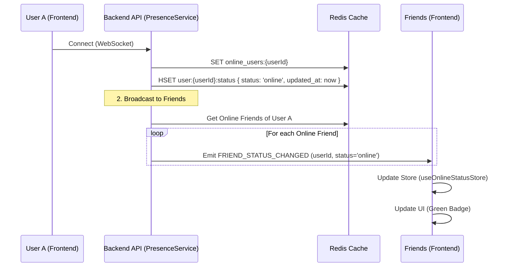
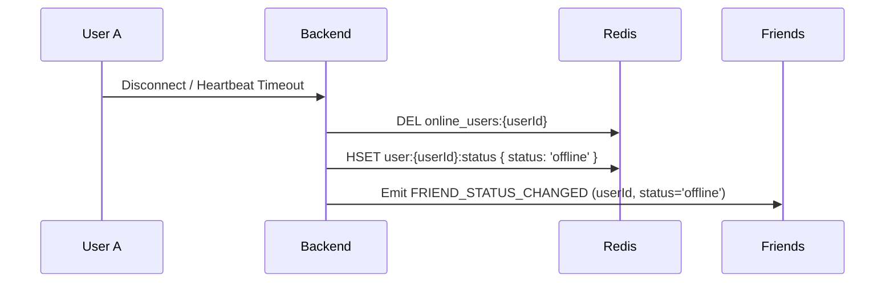

# Online Status Feature Flow

> **Last Updated:** 2026-01-04
> **Feature:** Real-time Online Status
> **Components:** WebSocket, Redis, API, Store
> **Status:** Implemented

This document details the architecture and implementation of the real-time online status system, which tracks user presence and synchronizes it across friends and conversation partners.

## Overview

The online status system uses a heartbeat-based mechanism backed by **Redis** to track user presence. It ensures that when a user connects or disconnects, their status is broadcasted in real-time to relevant other users (friends and people they have open chats with).

## Architecture & Data Flow

### 1. Connection & Status Broadcast Flow

When a user connects, their status is immediately updated in Redis and broadcasted.



### 2. Disconnection Flow



## Redis Data Structures

We use Redis sets and hashes to efficiently manage presence data with TTLs.

| Key Pattern | Data Type | Purpose | TTL |
| :--- | :--- | :--- | :--- |
| `online_users` | Set | Global set of all currently online user IDs | N/A |
| `user:{userId}:status` | Hash | Detailed status info (last_seen, status enum) | 60s (Heartbeat) / 24h (Offline) |

### Key Operations

- **Set Online:**
  - `SADD online_users {userId}`
  - `HSET user:{userId}:status status 'online'`
  - `EXPIRE user:{userId}:status 60`
- **Set Offline:**
  - `SREM online_users {userId}`
  - `HSET user:{userId}:status status 'offline'`
- **Check Status:**
  - `SISMEMBER online_users {userId}`
- **Get Multiple Statuses:**
  - Pipeline `SISMEMBER` checks for efficient batch retrieval.

## API Endpoints

REST APIs are used to fetch initial status state when the application loads.

| Method | Endpoint | Description |
| :--- | :--- | :--- |
| `GET` | `/api/friends/online-status` | Get online status map for all friends of the current user |

## Code Examples

### Backend: Presence Service (Broadcast)

**File:** `apps/api/src/services/presence.service.ts`

```typescript
// Broadcast status change to friends and relevant users
private async broadcastStatusChange(userId: string, status: 'online' | 'offline'): Promise<void> {
  // 1. Get relevant users (Friends + Conversation Partners)
  const targetUserIds = await this.getRelevantUserIds(userId);

  // 2. Filter for those currently online (optimization)
  const onlineStatuses = await this.redisService.getMultipleUsersOnlineStatus(targetUserIds);
  const onlineTargetIds = targetUserIds.filter(id => onlineStatuses[id]);

  // 3. Emit event
  const payload = { user_id: userId, status, timestamp: Date.now() };
  for (const targetId of onlineTargetIds) {
    this.webSocketService.emitToUser(targetId, 'friend_status_changed', payload);
  }
}
```

### Frontend: Initial Hydration

**File:** `apps/web/src/components/templates/MessagesWebSocketProvider.tsx`

```typescript
// Hydrate initial status from API
const fetchFriendsOnlineStatus = useCallback(async () => {
  const response = await fetch(`${apiUrl}/friends/online-status`, { credentials: 'include' });
  if (response.ok) {
    const data = await response.json();
    setMultipleStatuses(data.data.statuses); // Updates Zustand store
  }
}, [setMultipleStatuses]);
```

### Frontend: Store Management

**File:** `apps/web/src/store/useOnlineStatusStore.ts`

```typescript
// efficient lookups via map
interface OnlineStatusState {
  statuses: Record<string, boolean>;
  // ... actions
}
```

## Related Documentation

- **[Chat Realtime Feature](./CHAT_REALTIME_FEATURE.md)** - Messaging flow
- **[WebSocket Events](./WEBSOCKET_EVENTS.md)** - Event specifications
