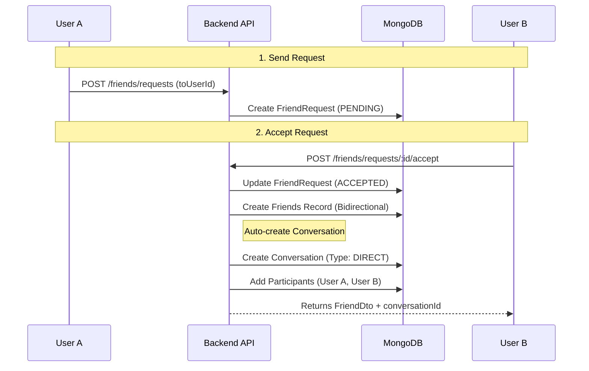
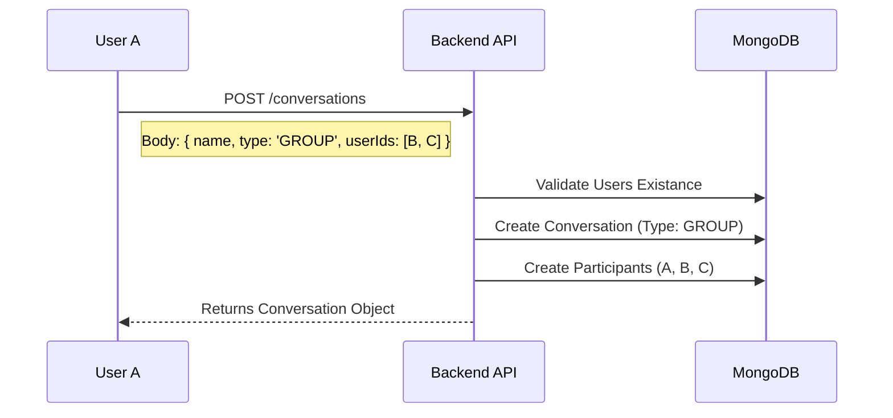

# Relationship & Conversation Features

> **Last Updated:** 2026-01-04
> **Feature:** Friend Requests, Direct & Group Conversations
> **Components:** API, Mongoose Models, Services
> **Status:** Implemented

This document details the workflows for managing user relationships (friends) and creating conversations (both direct 1-1 and group chats).

## Overview

The system treats "Friendship" and "Conversations" as distinct but related concepts.
- **Friendship:** A mutual agreement between two users. Required to initiate a Direct Message flow in the UI.
- **Conversation:** A distinct entity that holds messages.
    - **DIRECT:** 1-1 chat. Automatically created when a friend request is **accepted**.
    - **GROUP:** generic chat with 3+ members. Manually created by a user.

## Architecture & Data Flow

### 1. Friend Request & Acceptance Flow (Creates 1-1 Chat)

The acceptance of a friend request triggers the creation of a Direct Conversation.



### 2. Group Conversation Creation Flow

Group chats are created explicitly by selecting multiple users.



## Database Schema

### FriendRequest Collection
Tracks the state of a handshake between users.

```typescript
interface IFriendRequest {
  _id: ObjectId;
  fromUserId: ObjectId; // Ref: User
  toUserId: ObjectId;   // Ref: User
  status: 'PENDING' | 'ACCEPTED' | 'DECLINED';
  createdAt: Date;
  updatedAt: Date;
}
```

### Friends Collection
Represents an established link. Bidirectionality is enforced by the service logic (or single record viewed from both sides depending on implementation).

```typescript
interface IFriends {
  _id: ObjectId;
  userId: ObjectId;     // Ref: User
  friendId: ObjectId;   // Ref: User
  createdAt: Date;
}
```

### Conversation Collection
The container for the chat.

```typescript
interface IConversation {
  _id: ObjectId;
  name: string;
  type: 'DIRECT' | 'GROUP';
  ownerId: ObjectId;    // Ref: User
  avatar?: string;
  createdAt: Date;
}
```

## API Endpoints

### Friend Management

Base Route: `/api/v1/friends`

| Endpoint | Method | Description | Request | Response | Errors |
|----------|--------|-------------|---------|----------|--------|
| `/requests` | `GET` | Get all friend requests | None | `{ data: requests[] }` | `500` Error |
| `/requests` | `POST` | Send a friend request | `{ toUserId }` | `{ data: friendRequest }` | `400` Invalid/Exists, `404` Not found |
| `/requests/:id/accept` | `POST` | Accept request & create chat | Params: `id` | `{ data: { friendship, conversationId } }` | `404` Not found |
| `/requests/:id/decline` | `POST` | Decline request | Params: `id` | `{ success: true }` | `404` Not found |
| `/` | `GET` | List all friends | None | `{ data: friends[] }` | `500` Error |

### Conversation Management

Base Route: `/api/v1/conversations`

| Endpoint | Method | Description | Request | Response | Errors |
|----------|--------|-------------|---------|----------|--------|
| `/` | `GET` | Get all user conversations | None | `{ data: conversations[] }` | `500` Error |
| `/` | `POST` | Create conversation | `{ name, type: 'direct'\|'group', userIds }` | `{ data: conversation }` | `400` Invalid input |
| `/:id` | `GET` | Get conversation details | Params: `id` | `{ data: conversation }` | `404` Not found |
| `/:id` | `PUT` | Update conversation | `{ name }` | `{ success: true }` | `403` Not owner |
| `/:id` | `DELETE` | Delete conversation | Params: `id` | `{ success: true }` | `403` Not owner |
| `/:id/user` | `POST` | Add user to group | `{ userId }` | `{ success: true }` | `403` Not owner |
| `/:id/user` | `PUT` | Leave conversation | Params: `id` | `{ success: true }` | `404` Not found |
| `/:id/user` | `DELETE` | Remove user from group | `{ userId }` | `{ success: true }` | `403` Not owner |

## Code Examples

### Backend: Accepting Request & Creating Chat

**File:** `apps/api/src/services/friend.service.ts`

```typescript
async acceptFriendRequest(requestId: string, userId: string) {
  // 1. Update Request Status
  const friendRequest = await FriendRequest.findById(requestId);
  friendRequest.status = FriendRequestStatus.ACCEPTED;
  await friendRequest.save();

  // 2. Create Friendship
  const friendship = new Friends({
    userId: friendRequest.fromUserId,
    friendId: friendRequest.toUserId
  });
  await friendship.save();

  // 3. Auto-create Direct Conversation
  const conversationService = new ConversationService();
  const conversation = await conversationService.createConversation(
    "", // Name auto-generated
    friendRequest.fromUserId,
    ConversationType.DIRECT,
    [friendRequest.fromUserId, friendRequest.toUserId]
  );

  return { conversationId: conversation.id, ...friendship };
}
```

### Backend: Creating Group Chat

**File:** `apps/api/src/services/conversation.service.ts`

```typescript
async createConversation(name: string, ownerId: string, type: ConversationType, userIds: string[]) {
  // 1. Create Conversation Record
  const conversation = new Conversation({
    name,
    ownerId,
    type
  });
  const saved = await conversation.save();

  // 2. Add All Participants
  for (const userId of userIds) {
    await this.addUserToConversation(ownerId, saved.id, userId);
  }

  return saved;
}
```

## Related Documentation

- **[Database Schema](./DATABASE_SCHEMA.md)** - Full details on models
- **[Chat Realtime Feature](./CHAT_REALTIME_FEATURE.md)** - Messaging within these conversations
