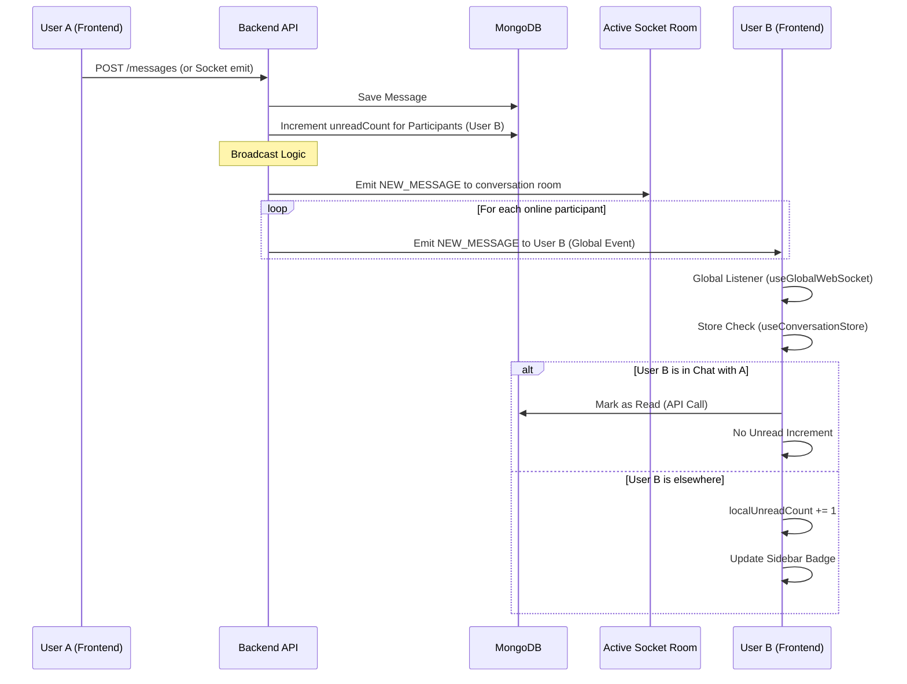

# Unread Message Count & Read Status Flow

> **Last Updated:** 2026-01-04
> **Feature:** Real-time Unread Counts
> **Components:** WebSocket, API, Store, UI components
> **Status:** Implemented

This document details the architecture and implementation of the real-time unread message count and "mark as read" feature in the Erion Raven chat application.

## Overview

The system ensures that users receive real-time updates for unread message counts even when they are not actively viewing the conversation. It handles:
1.  **Real-time increments** when a new message is received.
2.  **Real-time decrements/clearing** when a user reads a conversation.
3.  **Persistence** in MongoDB.

## Real-time Unread Count Flow

When User A sends a message to User B:



### Key Components

| Component | Responsibility |
| :--- | :--- |
| `WebSocketService` (Backend) | Iterates all conversation participants and sends `NEW_MESSAGE` to connected clients, ensuring delivery even if the room isn't joined. |
| `Participant` (DB Model) | Stores `unreadCount` and `lastReadAt` for each user-conversation pair. |
| `useGlobalWebSocket` (Frontend) | Listens for `chat-message` events globally (in `AppSidebar`). |
| `useConversationStore` (Frontend) | Manages client-side unread counts and handles logic to increment only if the chat isn't active. |

## Code Implementation

### Backend: Broadcasting

**File:** `apps/api/src/services/websocket.service.ts`

```typescript
// Increment unread count in DB
await Participant.updateMany(
  { conversationId, userId: { $ne: senderId } },
  { $inc: { unreadCount: 1 } }
);

// Get all participants
const participants = await Participant.find({ conversationId }).select('userId');

// Broadcast to all online participants
for (const participant of participants) {
  if (this.isOnline(participant.userId)) {
     this.emitToUser(participant.userId, SocketEvent.NEW_MESSAGE, messageDto);
  }
}
```

### Frontend: Global State Handling

**File:** `apps/web/src/store/useConversationStore.ts`

```typescript
handleNewMessage: (message) => {
  const state = get();
  const { conversationId } = message;

  // Only increment if we are NOT viewing this conversation
  if (conversationId !== state.currentConversation?.id) {
    const currentCount = state.unreadCounts[conversationId] || 0;
    set((s) => ({
      unreadCounts: {
        ...s.unreadCounts,
        [conversationId]: currentCount + 1
      }
    }));
  }
}
```

### Frontend: Automated Mark as Read

**File:** `apps/web/src/hooks/useWebSocketMessageHandler.tsx`

```typescript
if (conversationId && String(chatMessage.conversationId) === String(conversationId)) {
  // Add message to chat store
  upsertMessageToConversation(String(conversationId), message);
  
  // Mark as read immediately since user is viewing this conversation
  markAsRead(String(conversationId));
}
```
