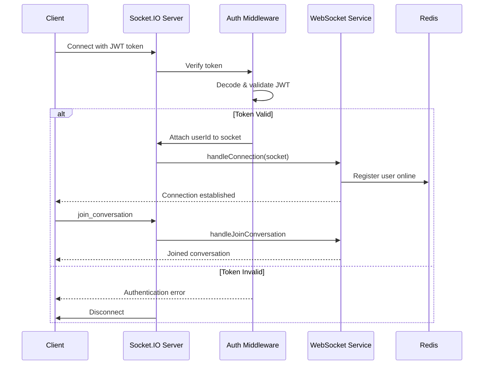
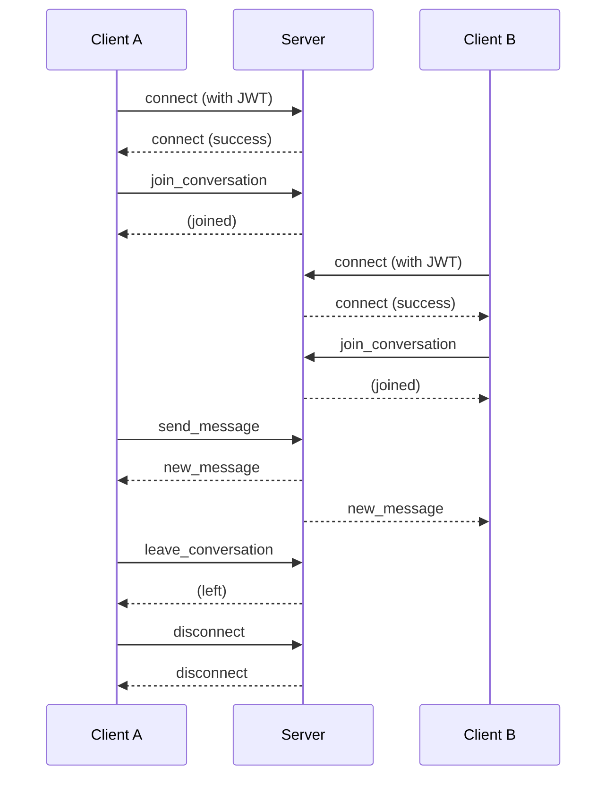

# WebSocket Events Documentation

> **Last Updated:** 2025-12-22  
> **WebSocket Library:** Socket.IO 4.x  
> **Version:** 1.0.0

## 📋 Table of Contents

- [Overview](#overview)
- [Connection Flow](#connection-flow)
- [Authentication](#authentication)
- [Client Events](#client-events)
- [Server Events](#server-events)
- [Error Handling](#error-handling)
- [Code Examples](#code-examples)
- [Best Practices](#best-practices)

---

## 🎯 Overview

The **erion-raven** application uses **Socket.IO** for real-time bidirectional communication between clients and the server. This enables instant message delivery, online status updates, and real-time notifications.

### Key Features

- ✅ **JWT Authentication** - Secure WebSocket connections
- ✅ **Room-based Messaging** - Conversation-specific message delivery
- ✅ **Auto-reconnection** - Client automatically reconnects on disconnect
- ✅ **Error Handling** - Comprehensive error reporting
- ✅ **Redis Pub/Sub** - Horizontal scaling support (future)

### Connection URL

```
Development:  ws://localhost:8080
Production:   wss://your-domain.com
```

---

## 🔄 Connection Flow



---

## 🔐 Authentication

### Client-Side Connection

**JavaScript/TypeScript:**
```typescript
import { io, Socket } from 'socket.io-client';

const socket: Socket = io('http://localhost:8080', {
  auth: {
    token: 'your-jwt-access-token'
  },
  transports: ['websocket'],
  reconnection: true,
  reconnectionAttempts: 5,
  reconnectionDelay: 1000
});

// Listen for connection
socket.on('connect', () => {
  console.log('Connected:', socket.id);
});

// Listen for auth errors
socket.on('connect_error', (error) => {
  console.error('Connection error:', error.message);
});
```

### Server-Side Authentication

The server validates the JWT token using the `socketAuth` middleware:

```typescript
// Middleware extracts token from socket.handshake.auth.token
// Verifies JWT and attaches userId to socket
socket.userId = decoded.userId;
socket.username = decoded.username;
```

**Authentication Errors:**
- `AUTHENTICATION_REQUIRED` - No token provided
- `INVALID_TOKEN` - Token is invalid or expired
- `TOKEN_EXPIRED` - Token has expired

---

## 📤 Client Events

Events sent **from client to server**.

### 1. `join_conversation`

Join a conversation room to receive messages.

**Event Name:** `join_conversation`

**Payload:**
```typescript
{
  conversation_id: string  // MongoDB ObjectId as string
}
```

**Example:**
```typescript
socket.emit('join_conversation', {
  conversation_id: '507f1f77bcf86cd799439011'
});
```

**Server Response:**
- Success: User is added to the conversation room
- Error: `error` event with code `JOIN_FAILED`

**Validation:**
- `conversation_id` is required
- User must be a participant of the conversation
- Conversation must exist and not be deleted

---

### 2. `leave_conversation`

Leave a conversation room.

**Event Name:** `leave_conversation`

**Payload:**
```typescript
{
  conversation_id: string  // MongoDB ObjectId as string
}
```

**Example:**
```typescript
socket.emit('leave_conversation', {
  conversation_id: '507f1f77bcf86cd799439011'
});
```

**Server Response:**
- Success: User is removed from the conversation room
- Error: `error` event with code `LEAVE_FAILED`

---

### 3. `send_message`

Send a message to a conversation.

**Event Name:** `send_message`

**Payload:**
```typescript
{
  conversation_id: string,    // Required
  text?: string,              // Optional (if url provided)
  url?: string,               // Optional (file URL)
  fileName?: string           // Optional (original file name)
}
```

**Example (Text Message):**
```typescript
socket.emit('send_message', {
  conversation_id: '507f1f77bcf86cd799439011',
  text: 'Hello, everyone!'
});
```

**Example (File Message):**
```typescript
socket.emit('send_message', {
  conversation_id: '507f1f77bcf86cd799439011',
  url: 'https://cdn.example.com/files/document.pdf',
  fileName: 'document.pdf'
});
```

**Server Response:**
- Success: `new_message` event broadcast to all conversation participants
- Error: `error` event with code `SEND_MESSAGE_FAILED`

**Validation:**
- `conversation_id` is required
- At least one of `text`, `url`, or `fileName` must be provided
- User must be a participant of the conversation

---

### 4. `disconnect`

Disconnect from the server (handled automatically by Socket.IO).

**Event Name:** `disconnect`

**Triggered by:**
- Client calling `socket.disconnect()`
- Network interruption
- Server shutdown

**Example:**
```typescript
socket.disconnect();
```

**Server Action:**
- User is unregistered from online users
- User is removed from all conversation rooms
- Redis cache is updated

---

## 📥 Server Events

Events sent **from server to client**.

### 1. `connect`

Emitted when the client successfully connects to the server.

**Event Name:** `connect`

**Payload:** None (Socket.IO built-in event)

**Example:**
```typescript
socket.on('connect', () => {
  console.log('Connected to server');
  console.log('Socket ID:', socket.id);
});
```

---

### 2. `new_message`

Emitted when a new message is sent to a conversation.

**Event Name:** `new_message`

**Payload:**
```typescript
{
  id: string,                 // Message ObjectId
  conversationId: string,     // Conversation ObjectId
  senderId: string,           // Sender User ObjectId
  senderName: string,         // Sender username
  text?: string,              // Message text (optional)
  url?: string,               // File URL (optional)
  fileName?: string,          // File name (optional)
  createdAt: string           // ISO 8601 timestamp
}
```

**Example:**
```typescript
socket.on('new_message', (message) => {
  console.log('New message:', message);
  
  // Update UI with new message
  addMessageToChat(message);
});
```

**Broadcast Scope:**
- Sent to all users in the conversation room
- Includes the sender (for confirmation)

---

### 3. `error`

Emitted when an error occurs during WebSocket operations.

**Event Name:** `error`

**Payload:**
```typescript
{
  code: string,        // Error code (e.g., 'JOIN_FAILED')
  message: string,     // Human-readable error message
  details?: string     // Additional error details (optional)
}
```

**Example:**
```typescript
socket.on('error', (error) => {
  console.error('WebSocket error:', error);
  
  // Display error to user
  showErrorNotification(error.message);
});
```

**Common Error Codes:**
- `AUTHENTICATION_REQUIRED` - No token provided
- `INVALID_TOKEN` - Token is invalid
- `TOKEN_EXPIRED` - Token has expired
- `CONNECTION_FAILED` - Connection setup failed
- `JOIN_FAILED` - Failed to join conversation
- `LEAVE_FAILED` - Failed to leave conversation
- `SEND_MESSAGE_FAILED` - Failed to send message
- `PERMISSION_DENIED` - User lacks permission

---

### 4. `connect_error`

Emitted when connection fails (Socket.IO built-in event).

**Event Name:** `connect_error`

**Payload:**
```typescript
Error {
  message: string,
  description?: any,
  context?: any
}
```

**Example:**
```typescript
socket.on('connect_error', (error) => {
  console.error('Connection error:', error.message);
  
  if (error.message === 'AUTHENTICATION_REQUIRED') {
    // Redirect to login
    redirectToLogin();
  }
});
```

---

### 5. `disconnect`

Emitted when the client disconnects from the server.

**Event Name:** `disconnect`

**Payload:**
```typescript
reason: string  // Disconnect reason
```

**Disconnect Reasons:**
- `io server disconnect` - Server forcefully disconnected
- `io client disconnect` - Client called disconnect()
- `ping timeout` - Client didn't respond to ping
- `transport close` - Network connection lost
- `transport error` - Transport error occurred

**Example:**
```typescript
socket.on('disconnect', (reason) => {
  console.log('Disconnected:', reason);
  
  if (reason === 'io server disconnect') {
    // Server kicked us out, try to reconnect
    socket.connect();
  }
});
```

---

## ⚠️ Error Handling

### Client-Side Error Handling

**Comprehensive Error Handler:**
```typescript
// Connection errors
socket.on('connect_error', (error) => {
  console.error('Connection error:', error.message);
  
  switch (error.message) {
    case 'AUTHENTICATION_REQUIRED':
    case 'INVALID_TOKEN':
    case 'TOKEN_EXPIRED':
      // Redirect to login
      window.location.href = '/login';
      break;
    default:
      // Show generic error
      showNotification('Connection failed. Retrying...', 'error');
  }
});

// WebSocket operation errors
socket.on('error', (error) => {
  console.error('WebSocket error:', error);
  
  switch (error.code) {
    case 'JOIN_FAILED':
      showNotification('Failed to join conversation', 'error');
      break;
    case 'SEND_MESSAGE_FAILED':
      showNotification('Failed to send message', 'error');
      break;
    case 'PERMISSION_DENIED':
      showNotification('You do not have permission', 'error');
      break;
    default:
      showNotification(error.message, 'error');
  }
});

// Disconnect handling
socket.on('disconnect', (reason) => {
  console.log('Disconnected:', reason);
  
  if (reason === 'io server disconnect') {
    // Manual reconnection
    socket.connect();
  }
  // Socket.IO will auto-reconnect for other reasons
});
```

### Server-Side Error Handling

The server emits errors using the `createErrorPayload` helper:

```typescript
import { createErrorPayload, SocketEvent } from '@raven/types';

// Emit error to client
const errorPayload = createErrorPayload(
  'JOIN_FAILED',
  'Failed to join conversation',
  'Conversation not found'
);
socket.emit(SocketEvent.ERROR, errorPayload);
```

---

## 💻 Code Examples

### Complete Client Implementation

**React + TypeScript Example:**

```typescript
import { useEffect, useState } from 'react';
import { io, Socket } from 'socket.io-client';

interface Message {
  id: string;
  conversationId: string;
  senderId: string;
  senderName: string;
  text?: string;
  createdAt: string;
}

export function useWebSocket(accessToken: string) {
  const [socket, setSocket] = useState<Socket | null>(null);
  const [messages, setMessages] = useState<Message[]>([]);
  const [isConnected, setIsConnected] = useState(false);

  useEffect(() => {
    // Initialize socket
    const newSocket = io('http://localhost:8080', {
      auth: { token: accessToken },
      transports: ['websocket'],
      reconnection: true,
      reconnectionAttempts: 5,
      reconnectionDelay: 1000,
    });

    // Connection events
    newSocket.on('connect', () => {
      console.log('Connected:', newSocket.id);
      setIsConnected(true);
    });

    newSocket.on('disconnect', (reason) => {
      console.log('Disconnected:', reason);
      setIsConnected(false);
    });

    newSocket.on('connect_error', (error) => {
      console.error('Connection error:', error.message);
      setIsConnected(false);
    });

    // Message events
    newSocket.on('new_message', (message: Message) => {
      console.log('New message:', message);
      setMessages((prev) => [...prev, message]);
    });

    // Error events
    newSocket.on('error', (error) => {
      console.error('WebSocket error:', error);
      alert(error.message);
    });

    setSocket(newSocket);

    // Cleanup
    return () => {
      newSocket.close();
    };
  }, [accessToken]);

  // Helper functions
  const joinConversation = (conversationId: string) => {
    socket?.emit('join_conversation', { conversation_id: conversationId });
  };

  const leaveConversation = (conversationId: string) => {
    socket?.emit('leave_conversation', { conversation_id: conversationId });
  };

  const sendMessage = (conversationId: string, text: string) => {
    socket?.emit('send_message', {
      conversation_id: conversationId,
      text,
    });
  };

  return {
    socket,
    isConnected,
    messages,
    joinConversation,
    leaveConversation,
    sendMessage,
  };
}
```

**Usage in Component:**

```typescript
function ChatRoom({ conversationId, accessToken }: Props) {
  const { isConnected, messages, joinConversation, sendMessage } = 
    useWebSocket(accessToken);
  const [messageText, setMessageText] = useState('');

  useEffect(() => {
    if (isConnected) {
      joinConversation(conversationId);
    }
  }, [isConnected, conversationId]);

  const handleSend = () => {
    if (messageText.trim()) {
      sendMessage(conversationId, messageText);
      setMessageText('');
    }
  };

  return (
    <div>
      <div>Status: {isConnected ? 'Connected' : 'Disconnected'}</div>
      
      <div className="messages">
        {messages.map((msg) => (
          <div key={msg.id}>
            <strong>{msg.senderName}:</strong> {msg.text}
          </div>
        ))}
      </div>

      <input
        value={messageText}
        onChange={(e) => setMessageText(e.target.value)}
        onKeyPress={(e) => e.key === 'Enter' && handleSend()}
      />
      <button onClick={handleSend}>Send</button>
    </div>
  );
}
```

---

## ✅ Best Practices

### 1. **Always Handle Errors**

```typescript
socket.on('error', (error) => {
  // Log for debugging
  console.error('WebSocket error:', error);
  
  // Show user-friendly message
  showNotification(error.message);
});
```

### 2. **Clean Up on Unmount**

```typescript
useEffect(() => {
  const socket = io(/* ... */);
  
  return () => {
    socket.close();  // Important!
  };
}, []);
```

### 3. **Join Conversations After Connection**

```typescript
socket.on('connect', () => {
  // Re-join conversations after reconnection
  currentConversations.forEach((convId) => {
    socket.emit('join_conversation', { conversation_id: convId });
  });
});
```

### 4. **Handle Reconnection**

```typescript
socket.on('disconnect', (reason) => {
  if (reason === 'io server disconnect') {
    // Server kicked us, manually reconnect
    socket.connect();
  }
  // Auto-reconnect for other reasons
});
```

### 5. **Validate Payloads**

```typescript
// Client-side validation before emitting
function sendMessage(conversationId: string, text: string) {
  if (!conversationId || !text.trim()) {
    console.error('Invalid message payload');
    return;
  }
  
  socket.emit('send_message', {
    conversation_id: conversationId,
    text: text.trim(),
  });
}
```

### 6. **Use TypeScript Types**

```typescript
import {
  JoinConversationPayload,
  SendMessagePayload,
  NewMessagePayload
} from '@raven/types';

socket.emit('join_conversation', {
  conversation_id: '123'
} as JoinConversationPayload);

socket.on('new_message', (message: NewMessagePayload) => {
  // TypeScript knows the shape of message
});
```

---

## 🔄 Event Flow Diagram



---

## 📚 Related Documentation

- **[Architecture](./ARCHITECTURE.md)** - System architecture overview
- **[API Design](./API_DESIGN.md)** - REST API endpoints
- **[Database Schema](./DATABASE_SCHEMA.md)** - MongoDB schema
- **[Development Guide](./DEVELOPMENT.md)** - Local setup

---

## 🔄 Version History

| Version | Date | Changes |
|---------|------|---------|
| 1.0.0 | 2025-12-22 | Initial WebSocket events documentation |

---

## 📞 Support

For questions about WebSocket events:
- **GitHub Issues:** [erion-raven/issues](https://github.com/EricNguyen1206/erion-raven/issues)
- **Email:** eric.nguyen@example.com
